# Отчёт по лабораторной работе №1

## Цель и источник данных

В работе реализованы `FileBucketHash`, `StaticPerfectHash` и `TextLSH` на C# под `.NET 10`.
Все численные значения ниже взяты из текущих файлов в `hw1/report/artifacts`:
- `Hw1.Benchmarks.FileBucketHashBenchmarks-report.csv`
- `Hw1.Benchmarks.StaticPerfectHashBenchmarks-report.csv`
- `Hw1.Benchmarks.TextLshBenchmarks-report.csv`
- `benchmark_quality.md`

## Конфигурация измерений

Измерения выполняются через `StableBenchmarkConfig` с параметрами `LaunchCount=1`, `WarmupCount=15` и `IterationCount=40`. Во всех benchmark-методах используется пакетный запуск операций через `OperationsPerInvoke`. Для каждого семейства тестов используется 10 логарифмически распределённых значений `N`.

## Организация benchmark-сценариев

Для `FileBucketHash` измеряется путь обновления существующего ключа, для `StaticPerfectHash` измеряется поиск по статическому индексу, для `TextLSH` измеряется запрос к LSH-индексу и к full scan как базовому сравнению. Для всех серий сохраняются `Mean`, `StdDev`, `Ratio` и данные по памяти из BenchmarkDotNet.

## Таблицы результатов

### FileBucketHash

| Method | N | Mean | Error | StdDev | Median | Ratio | RatioSD | Allocated | Alloc Ratio |
|---|---:|---:|---:|---:|---:|---:|---:|---:|---:|
| InsertFileHash | 10000 | 175.906 ns | 23.8168 ns | 42.3344 ns | 156.032 ns | 33.69 | 8.43 | 0 B | NA |
| InsertDictionary | 10000 | 5.251 ns | 0.2335 ns | 0.4089 ns | 5.221 ns | 1.01 | 0.11 | 0 B | NA |
| InsertFileHash | 100000 | 216.092 ns | 8.0404 ns | 13.6531 ns | 215.317 ns | 38.93 | 3.20 | 0 B | NA |
| InsertDictionary | 100000 | 5.567 ns | 0.1822 ns | 0.3095 ns | 5.537 ns | 1.00 | 0.08 | 0 B | NA |

### StaticPerfectHash

| Method | N | Mean | Error | StdDev | Ratio | RatioSD | Allocated | Alloc Ratio |
|---|---:|---:|---:|---:|---:|---:|---:|---:|
| LookupPerfectHash | 10000 | 108.53 ns | 5.934 ns | 10.236 ns | 8.01 | 1.03 | 52 B | NA |
| LookupDictionary | 10000 | 13.65 ns | 0.708 ns | 1.258 ns | 1.01 | 0.13 | 0 B | NA |
| LookupPerfectHash | 100000 | 346.96 ns | 28.990 ns | 51.529 ns | 10.38 | 1.90 | 64 B | NA |
| LookupDictionary | 100000 | 33.82 ns | 2.127 ns | 3.782 ns | 1.01 | 0.16 | 0 B | NA |

### TextLSH

| Method | N | Mean | Error | StdDev | Ratio | RatioSD | Allocated | Alloc Ratio |
|---|---:|---:|---:|---:|---:|---:|---:|---:|
| QueryLsh | 1000 | 35.824 μs | 3.9134 μs | 6.9560 μs | 0.34 | 0.11 | 19.48 KB | 1.72 |
| QueryFullScan | 1000 | 111.474 μs | 14.7661 μs | 26.2467 μs | 1.06 | 0.37 | 11.3 KB | 1.00 |
| QueryLsh | 10000 | 465.513 μs | 12.1036 μs | 20.5528 μs | 0.80 | 0.19 | 134.16 KB | 1.64 |
| QueryFullScan | 10000 | 626.534 μs | 106.1442 μs | 188.6713 μs | 1.08 | 0.42 | 81.86 KB | 1.00 |

## Графики по бенчмаркам

### FileBucketHash

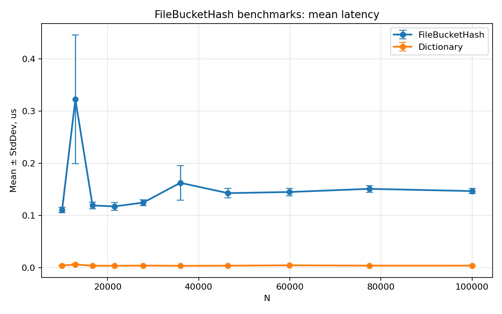
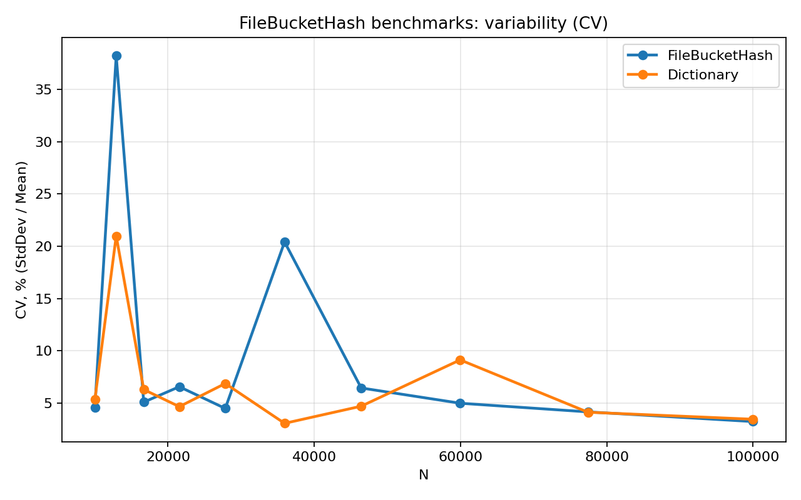
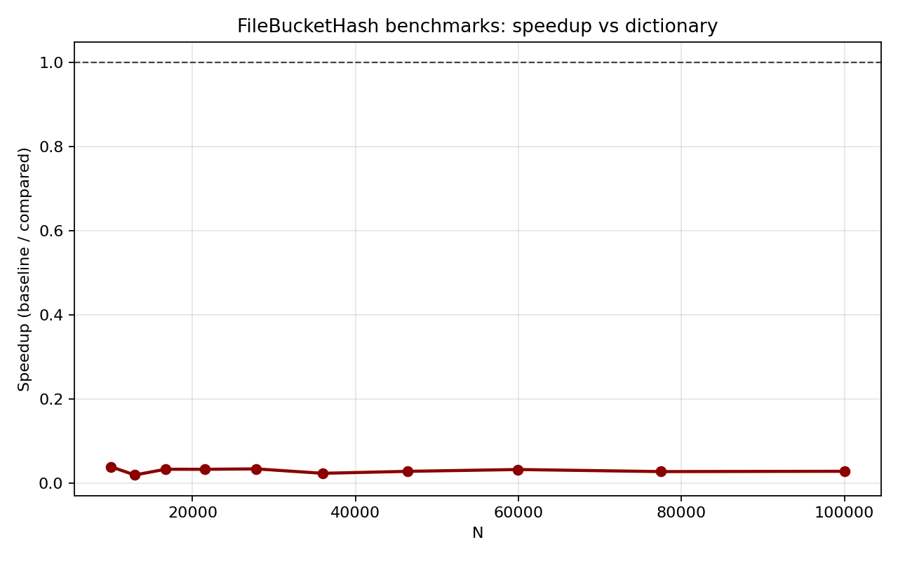
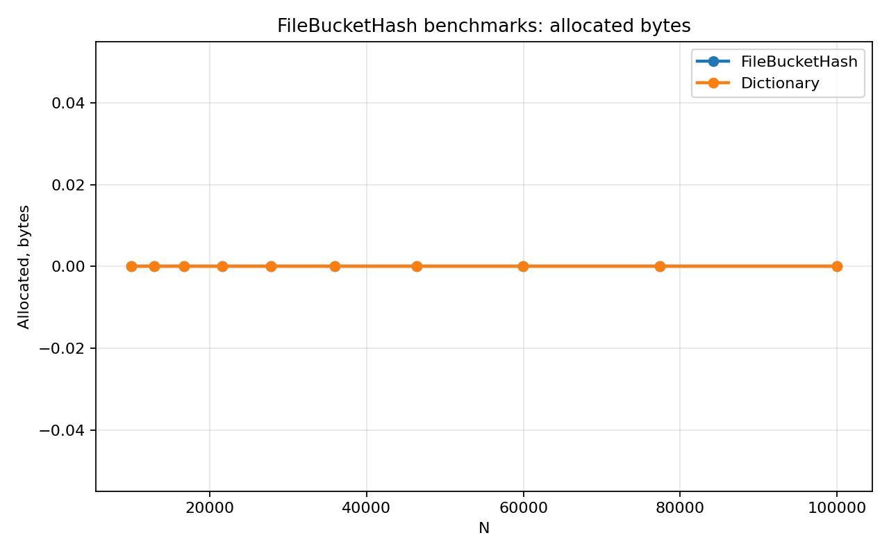

График `Mean ± StdDev` показывает зависимость времени от `N` для `FileBucketHash` и базового `Dictionary`. График CV показывает относительную вариативность по тем же точкам. График speedup показывает отношение `Dictionary / FileBucketHash`, значения ниже единицы соответствуют более быстрому базовому `Dictionary`. График allocated фиксирует объём выделений памяти в тестируемых сценариях.

### StaticPerfectHash

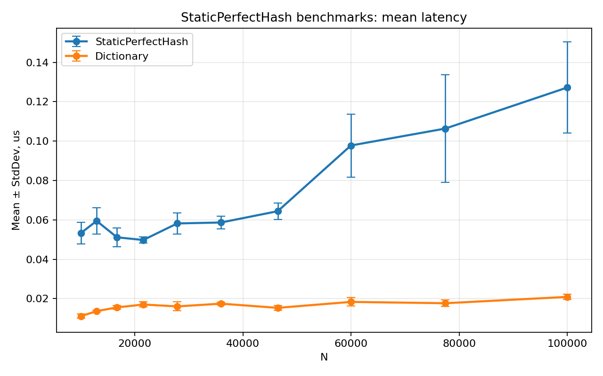
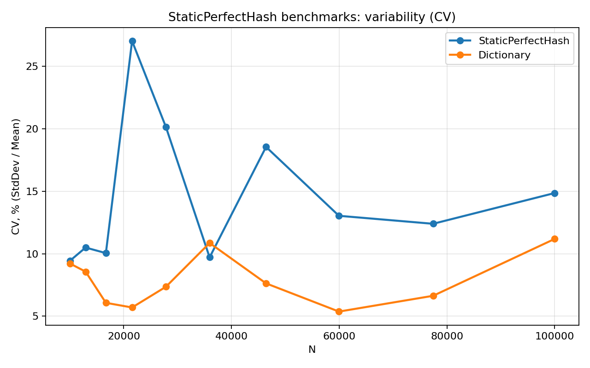
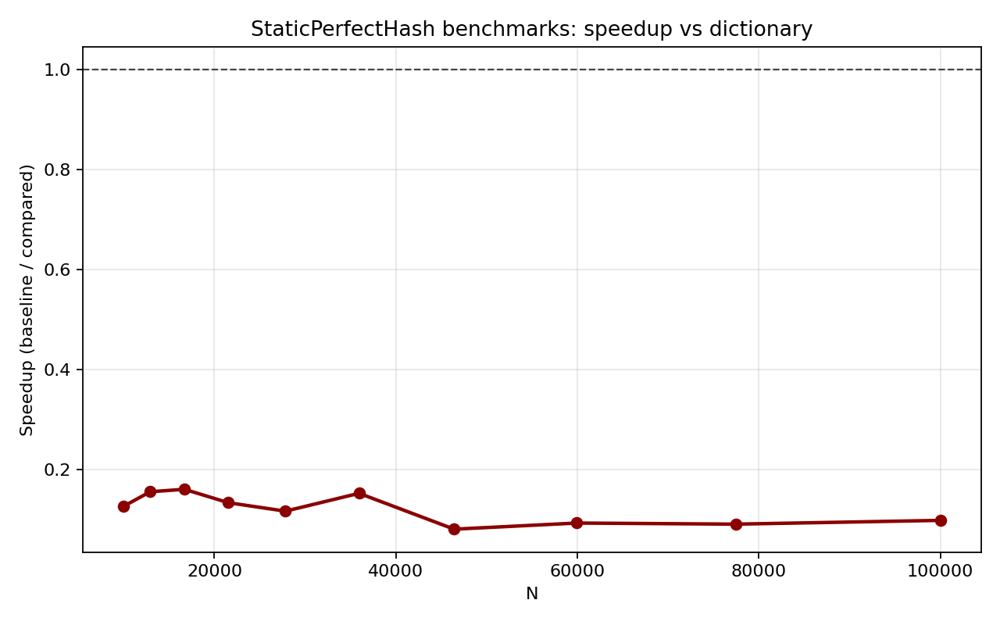
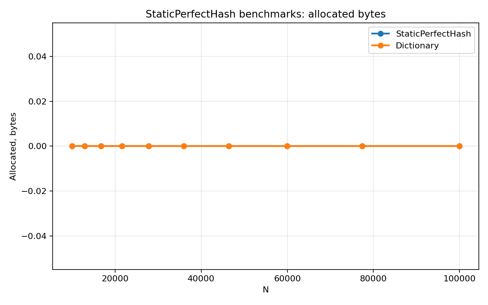

График `Mean ± StdDev` показывает динамику времени для `StaticPerfectHash` и `Dictionary` при росте `N`. График CV дополняет сравнение относительным отклонением. График speedup отражает отношение `Dictionary / StaticPerfectHash`. График allocated показывает распределение выделений памяти между вариантами.

### TextLSH

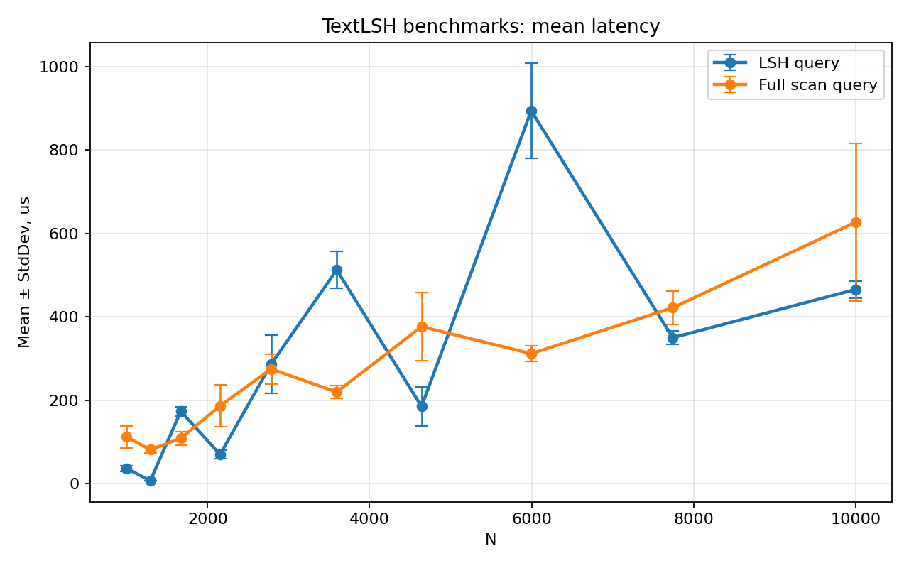
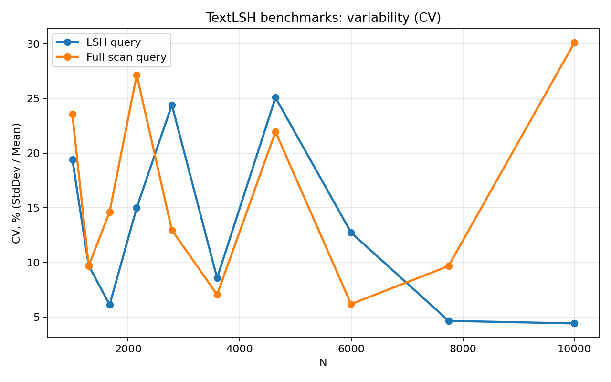
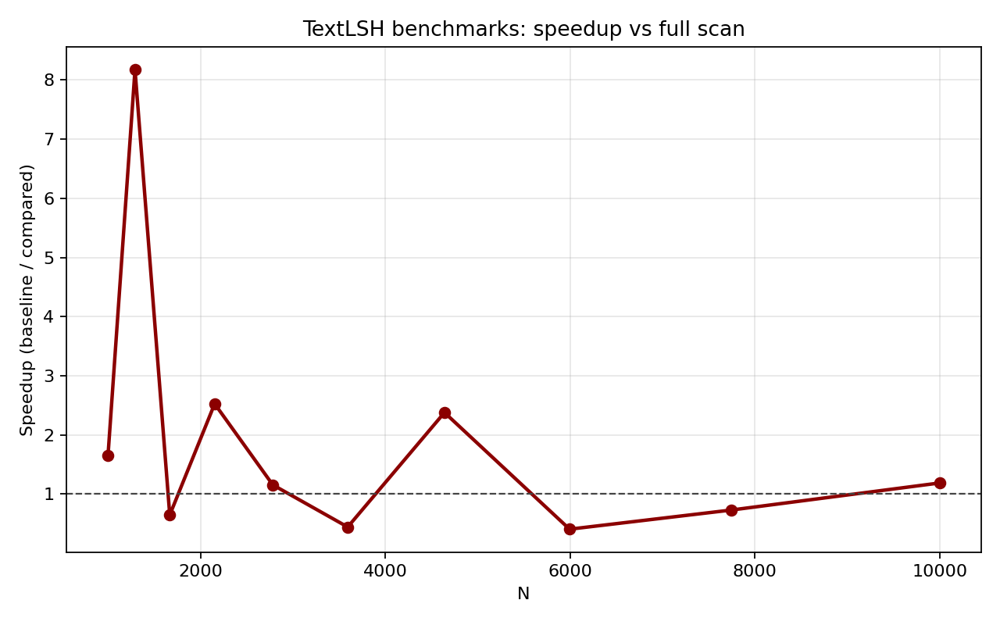
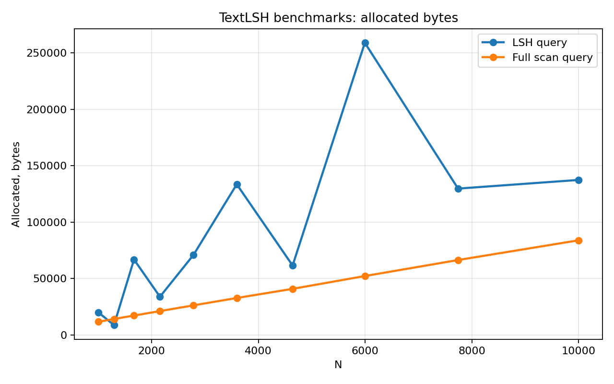

График `Mean ± StdDev` показывает время `QueryLsh` и `QueryFullScan` в зависимости от `N`. График speedup построен как `FullScan / LSH`, значения выше единицы соответствуют ускорению LSH относительно полного перебора. График allocated показывает объём выделений памяти в обоих сценариях запроса.

## Профайлинг и FlameGraph

Для CPU трассировки используется `make profile-cpu PID=<pid>` с сохранением `cpu-trace.nettrace`. Для памяти используется `make profile-memory PID=<pid>` с сохранением `memory.gcdump`. Для async-профилирования используется `make profile-async PID=<pid>` с сохранением `async-counters.csv` и `async-trace.nettrace`. Для flame graph используется `make profile-flamegraph PID=<pid>` с сохранением `cpu-flamegraph.speedscope.json`, который открывается в `speedscope`. После `make bench-collect` автоматически формируется `benchmark_quality.md` с фактическими значениями `Mean`, `StdDev` и `CV` по всем точкам.

## Вывод

Текущие артефакты показывают, что в сценариях `FileBucketHash` и `StaticPerfectHash` baseline `Dictionary` заметно быстрее по latency, тогда как для `TextLSH` наблюдается ускорение относительно full scan на части диапазона `N` при более высокой стоимости по памяти.
