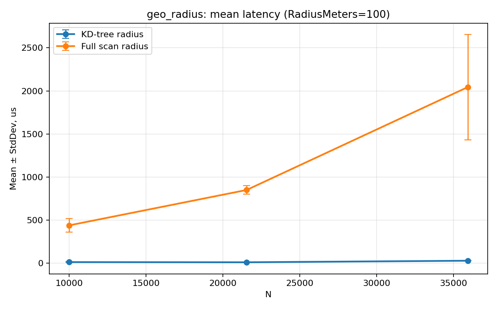
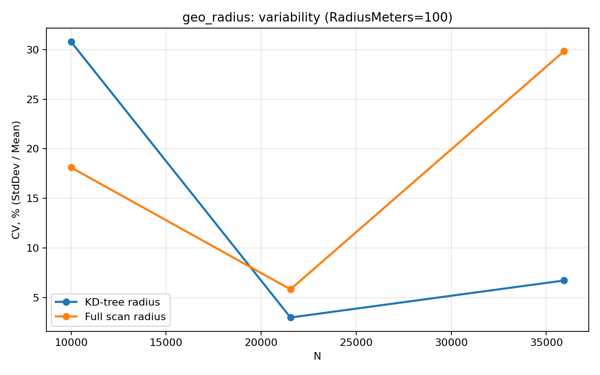
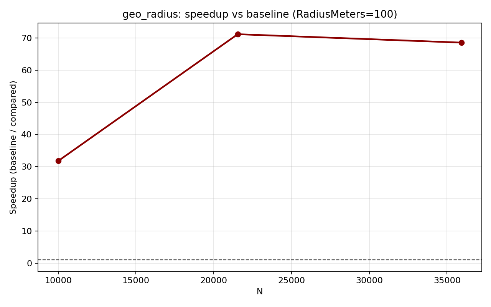
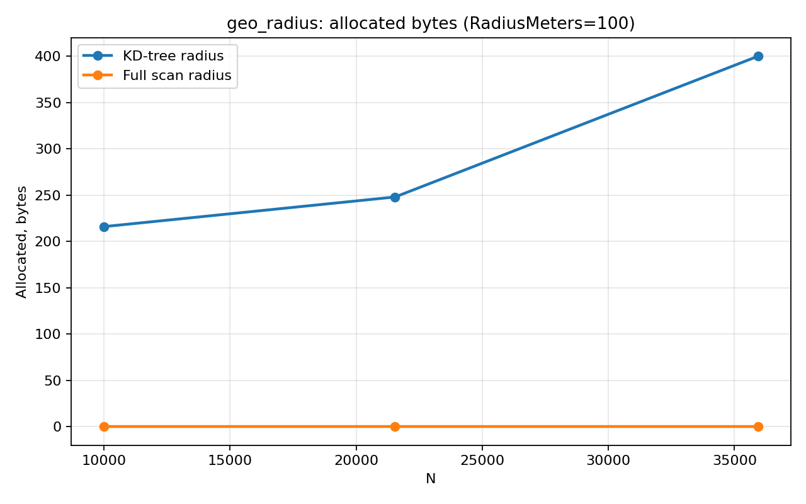
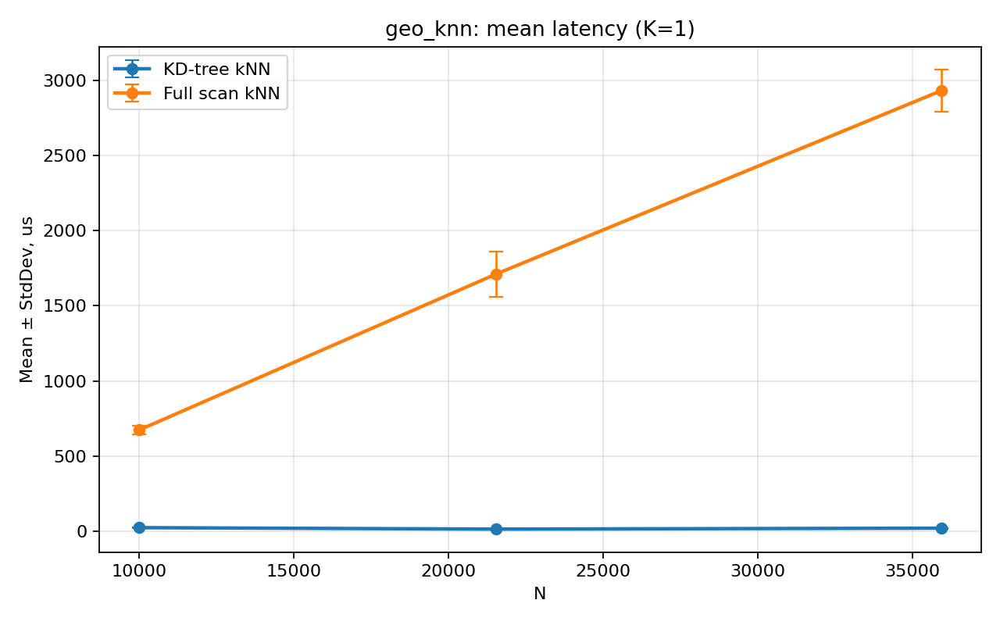
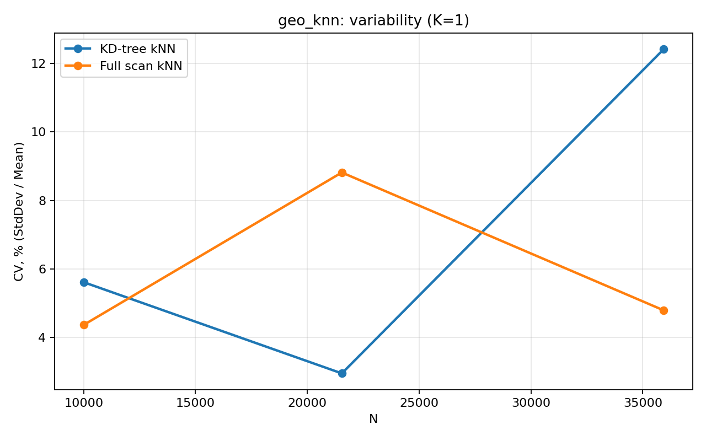
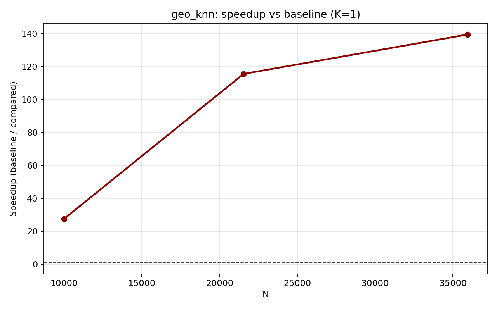
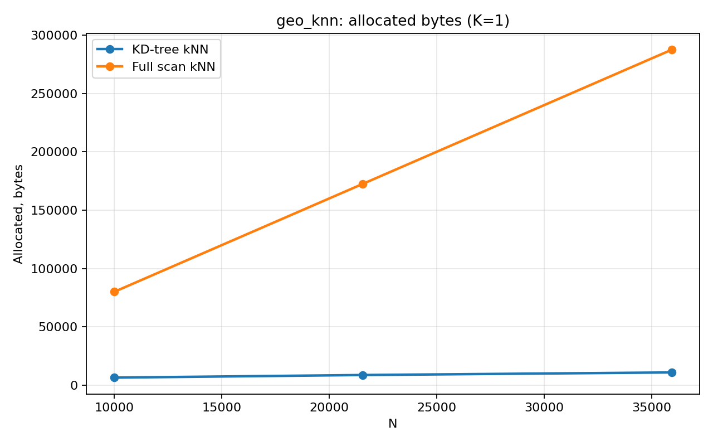

# Отчёт по лабораторной работе №2

## Цель и источник данных

В работе реализован гео-индекс на `KD-tree` для координат `Lat/Lng` с операциями:

- `Insert`
- `SearchRadius`
- `SearchKNearest`

Все численные результаты взяты из:

- `Hw2.Benchmarks.GeoKdTreeRadiusBenchmarks-report.csv`
- `Hw2.Benchmarks.GeoKdTreeKnnBenchmarks-report.csv`
- `benchmark_quality.md`

## Конфигурация измерений

Измерения выполнялись через `StableBenchmarkConfig`:

- `LaunchCount=1`
- `WarmupCount=15`
- `IterationCount=40`

Параметры бенчмарков:

- `N`: `10000`, `21544`, `35938`
- `RadiusMeters`: `100`, `5000`
- `K`: `1`, `20`

## Таблицы результатов

### Radius query (`SearchRadius` vs full scan)

| Method              | N     | RadiusMeters | Mean       | StdDev     | Allocated |
| ------------------- | ----- | ------------ | ---------- | ---------- | --------- |
| QueryKdTreeRadius   | 10000 | 100          | 13.86 us   | 4.267 us   | 216 B     |
| QueryFullScanRadius | 10000 | 100          | 440.31 us  | 79.783 us  | 0 B       |
| QueryKdTreeRadius   | 21544 | 5000         | 30.58 us   | 2.327 us   | 248 B     |
| QueryFullScanRadius | 21544 | 5000         | 1016.27 us | 56.078 us  | 0 B       |
| QueryKdTreeRadius   | 35938 | 100          | 29.81 us   | 2.005 us   | 400 B     |
| QueryFullScanRadius | 35938 | 100          | 2044.02 us | 609.976 us | 0 B       |

### k-NN query (`SearchKNearest` vs full scan)

| Method           | N     | K   | Mean       | StdDev     | Allocated |
| ---------------- | ----- | --- | ---------- | ---------- | --------- |
| QueryKdTreeKnn   | 10000 | 1   | 24.51 us   | 1.375 us   | 6.36 KB   |
| QueryFullScanKnn | 10000 | 1   | 674.39 us  | 29.407 us  | 78.18 KB  |
| QueryKdTreeKnn   | 21544 | 20  | 45.09 us   | 1.894 us   | 17.11 KB  |
| QueryFullScanKnn | 21544 | 20  | 1597.40 us | 54.674 us  | 168.37 KB |
| QueryKdTreeKnn   | 35938 | 1   | 21.01 us   | 2.610 us   | 10.7 KB   |
| QueryFullScanKnn | 35938 | 1   | 2929.96 us | 140.236 us | 280.82 KB |

## Графики по бенчмаркам

### Radius query

### k-NN query

## Профайлинг памяти и CPU

CPU Flamegraph Radius:

CPU Flamegraph kNN:

Выделение памяти:

Бенчмарки запускались с `MemoryDiagnoser`, что дало профиль аллокаций по операциям в таблицах выше.

`make profile-all-bench FILTER=*GeoKdTree* DURATION=00:00:45`

- `make profile-cpu PID=<pid>` -> `cpu-trace.nettrace`
- `make profile-memory PID=<pid>` -> `memory.gcdump`
- `make profile-async PID=<pid>` -> `async-counters.csv`, `async-trace.nettrace`
- `make profile-flamegraph PID=<pid>` -> `cpu-flamegraph.speedscope.json`

## Анализ узких мест и гипотезы оптимизации

- Основной CPU hotspot baseline-подходов — полный перебор всех точек и массовые вызовы Haversine в `FullScan` сценариях.
- Для `SearchKNearest` у `KD-tree` видны стабильные аллокации (список кандидатов и итоговые результаты); по сравнению с full scan это значительно меньше, но не ноль.
- В radius-сценарии вариативность выше на маленьких `N` и малом радиусе (по `CV`), что согласуется с коротким временем итераций и предупреждениями BenchmarkDotNet о маленьком `MinIterationTime`.

Гипотезы улучшения:

- уменьшить число аллокаций в `SearchKNearest` за счёт `ArrayPool`/переиспользуемых буферов для top-K;
- хранить bounding box в узлах, чтобы делать более сильный pruning и для ветвей по `longitude`;
- рассмотреть итеративный обход вместо глубокой рекурсии в hot path;
- добавить адаптивный выбор метрики lower-bound (быстрая аппроксимация + точный Haversine на финальном шаге).

