# Отчёт по HW3: ANN-бенчмарк

## Пресет
- `final`

## Критерии сравнения
- Основные метрики: `Recall@100`, `QPS`, `latency_ms`, `build_s`, `size_mb`, `CV(QPS)`.
- Правило выбора: сначала ограничение `Recall@100 >= 0.8` (если достижимо), затем максимум `QPS`, далее минимум `size_mb`, затем минимум `build_s`.

## Результаты

### Агрегированные метрики

95% доверительные интервалы

| Алгоритм | Конфигурация | Recall@100 (CI) | QPS (CI) | Latency ms (CI) | Build s | Size MB |
|---|---|---:|---:|---:|---:|---:|
| hnsw | `{"ef_construction": 200, "ef_search": 128, "m": 32}` | 0.9829 | 1181±17 | 0.8470±0.0125 | 112.71 | 318.93 |
| hnsw | `{"ef_construction": 200, "ef_search": 192, "m": 16}` | 0.9824 | 1107±33 | 0.9041±0.0279 | 97.18 | 306.73 |
| hnsw | `{"ef_construction": 200, "ef_search": 128, "m": 16}` | 0.9652 | 1581±10 | 0.6326±0.0040 | 95.56 | 306.73 |
| ivf_flat | `{"nlist": 1024, "nprobe": 256}` | 0.9975 | 167±1 | 5.9892±0.0336 | 7.71 | 296.74 |
| ivf_flat | `{"nlist": 1024, "nprobe": 128}` | 0.9841 | 328±2 | 3.0476±0.0162 | 7.68 | 296.74 |
| ivf_flat | `{"nlist": 1024, "nprobe": 64}` | 0.9467 | 633±13 | 1.5796±0.0334 | 6.89 | 296.74 |
| ivfpq | `{"m_pq": 192, "nlist": 512, "nprobe": 512, "pq_bits": 8}` | 0.8617 | 70±0 | 14.3658±0.0729 | 32.95 | 21.33 |
| ivfpq | `{"m_pq": 96, "nlist": 512, "nprobe": 256, "pq_bits": 8}` | 0.6394 | 282±1 | 3.5435±0.0162 | 24.55 | 12.17 |
| ivfpq | `{"m_pq": 96, "nlist": 1024, "nprobe": 256, "pq_bits": 8}` | 0.6363 | 353±2 | 2.8367±0.0180 | 27.06 | 13.68 |
| ivfpq | `{"m_pq": 96, "nlist": 1024, "nprobe": 128, "pq_bits": 8}` | 0.6354 | 681±9 | 1.4687±0.0183 | 27.10 | 13.68 |
| ivfpq | `{"m_pq": 48, "nlist": 1024, "nprobe": 256, "pq_bits": 10}` | 0.5407 | 157±1 | 6.3770±0.0249 | 99.76 | 12.49 |
| ivfpq | `{"m_pq": 48, "nlist": 1024, "nprobe": 128, "pq_bits": 10}` | 0.5404 | 283±1 | 3.5367±0.0127 | 119.60 | 12.49 |
| ivfpq | `{"m_pq": 12, "nlist": 1024, "nprobe": 128, "pq_bits": 10}` | 0.3731 | 1038±10 | 0.9637±0.0092 | 55.19 | 8.20 |
| ivfpq | `{"m_pq": 16, "nlist": 1024, "nprobe": 128, "pq_bits": 8}` | 0.3545 | 3251±126 | 0.3079±0.0119 | 19.86 | 6.05 |
| ivfpq | `{"m_pq": 16, "nlist": 1024, "nprobe": 96, "pq_bits": 8}` | 0.3545 | 4091±82 | 0.2445±0.0050 | 20.42 | 6.05 |
| lsh | `{"nbits": 2048}` | 0.6195 | 401±3 | 2.4908±0.0183 | 1.71 | 30.41 |
| lsh | `{"nbits": 1536}` | 0.5683 | 577±10 | 1.7330±0.0294 | 1.04 | 22.81 |
| lsh | `{"nbits": 1024}` | 0.4871 | 947±9 | 1.0562±0.0100 | 0.67 | 15.21 |

### Топ-3 по Recall внутри каждого алгоритма

- **hnsw**
  - `{"ef_construction": 200, "ef_search": 128, "m": 32}` | recall=0.9829, qps=1181±17, size=318.93MB
  - `{"ef_construction": 200, "ef_search": 192, "m": 16}` | recall=0.9824, qps=1107±33, size=306.73MB
  - `{"ef_construction": 200, "ef_search": 128, "m": 16}` | recall=0.9652, qps=1581±10, size=306.73MB
- **ivf_flat**
  - `{"nlist": 1024, "nprobe": 256}` | recall=0.9975, qps=167±1, size=296.74MB
  - `{"nlist": 1024, "nprobe": 128}` | recall=0.9841, qps=328±2, size=296.74MB
  - `{"nlist": 1024, "nprobe": 64}` | recall=0.9467, qps=633±13, size=296.74MB
- **ivfpq**
  - `{"m_pq": 192, "nlist": 512, "nprobe": 512, "pq_bits": 8}` | recall=0.8617, qps=70±0, size=21.33MB
  - `{"m_pq": 96, "nlist": 512, "nprobe": 256, "pq_bits": 8}` | recall=0.6394, qps=282±1, size=12.17MB
  - `{"m_pq": 96, "nlist": 1024, "nprobe": 256, "pq_bits": 8}` | recall=0.6363, qps=353±2, size=13.68MB
- **lsh**
  - `{"nbits": 2048}` | recall=0.6195, qps=401±3, size=30.41MB
  - `{"nbits": 1536}` | recall=0.5683, qps=577±10, size=22.81MB
  - `{"nbits": 1024}` | recall=0.4871, qps=947±9, size=15.21MB

### Топ-3 по QPS внутри каждого алгоритма

- **hnsw**
  - `{"ef_construction": 200, "ef_search": 128, "m": 16}` | qps=1581±10, recall=0.9652, size=306.73MB
  - `{"ef_construction": 200, "ef_search": 128, "m": 32}` | qps=1181±17, recall=0.9829, size=318.93MB
  - `{"ef_construction": 200, "ef_search": 192, "m": 16}` | qps=1107±33, recall=0.9824, size=306.73MB
- **ivf_flat**
  - `{"nlist": 1024, "nprobe": 64}` | qps=633±13, recall=0.9467, size=296.74MB
  - `{"nlist": 1024, "nprobe": 128}` | qps=328±2, recall=0.9841, size=296.74MB
  - `{"nlist": 1024, "nprobe": 256}` | qps=167±1, recall=0.9975, size=296.74MB
- **ivfpq**
  - `{"m_pq": 16, "nlist": 1024, "nprobe": 96, "pq_bits": 8}` | qps=4091±82, recall=0.3545, size=6.05MB
  - `{"m_pq": 16, "nlist": 1024, "nprobe": 128, "pq_bits": 8}` | qps=3251±126, recall=0.3545, size=6.05MB
  - `{"m_pq": 12, "nlist": 1024, "nprobe": 128, "pq_bits": 10}` | qps=1038±10, recall=0.3731, size=8.20MB
- **lsh**
  - `{"nbits": 1024}` | qps=947±9, recall=0.4871, size=15.21MB
  - `{"nbits": 1536}` | qps=577±10, recall=0.5683, size=22.81MB
  - `{"nbits": 2048}` | qps=401±3, recall=0.6195, size=30.41MB

### Лучшие конфигурации

- **lsh**: `{"nbits": 2048}` | recall=0.6195, qps=401, size=30.41MB, build=1.71s (fallback: maximize recall then qps)
- **hnsw**: `{"ef_construction": 200, "ef_search": 128, "m": 16}` | recall=0.9652, qps=1581, size=306.73MB, build=95.56s (recall>=0.8, then max qps)
- **ivfpq**: `{"m_pq": 192, "nlist": 512, "nprobe": 512, "pq_bits": 8}` | recall=0.8617, qps=70, size=21.33MB, build=32.95s (recall>=0.8, then max qps)
- **ivf_flat**: `{"nlist": 1024, "nprobe": 64}` | recall=0.9467, qps=633, size=296.74MB, build=6.89s (recall>=0.8, then max qps)

## Интерпретация

- LSH: выбрана `{"nbits": 2048}`; recall=0.6195, qps=401, size=30.41MB, build=1.71s.
- HNSW: выбрана `{"ef_construction": 200, "ef_search": 128, "m": 16}`; recall=0.9652, qps=1581, size=306.73MB, build=95.56s.
- IVFPQ: выбрана `{"m_pq": 192, "nlist": 512, "nprobe": 512, "pq_bits": 8}`; recall=0.8617, qps=70, size=21.33MB, build=32.95s.
- IVF_FLAT: выбрана `{"nlist": 1024, "nprobe": 64}`; recall=0.9467, qps=633, size=296.74MB, build=6.89s.
- Итоговый победитель определяется по явному критерию: recall-ограничение -> максимум QPS -> минимум размера и времени сборки.
- Доверительные интервалы (95% CI) считаются по фактическому числу повторов в строке.

## Графики сравнения алгоритмов

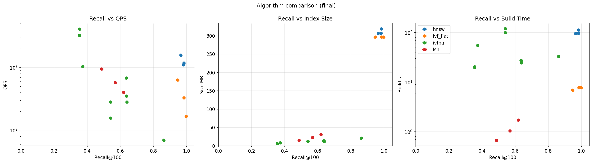

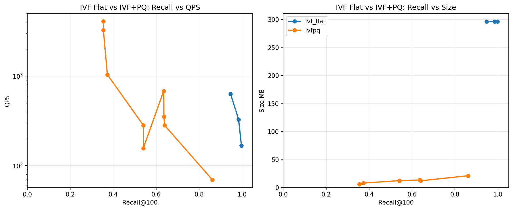

## Графики влияния параметров

### HNSW: влияние m
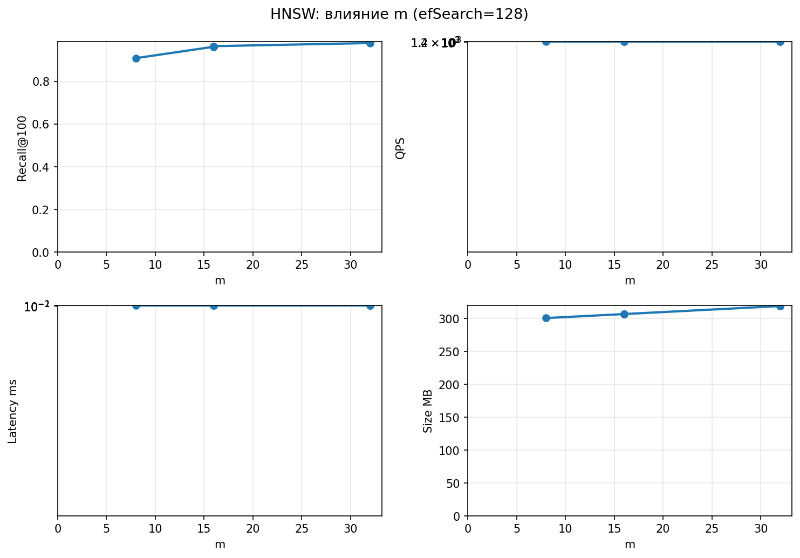

### HNSW: влияние efSearch
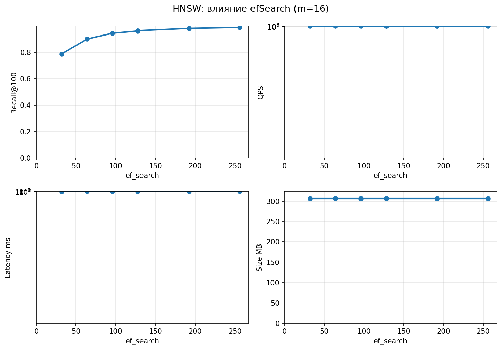

### LSH: влияние nbits
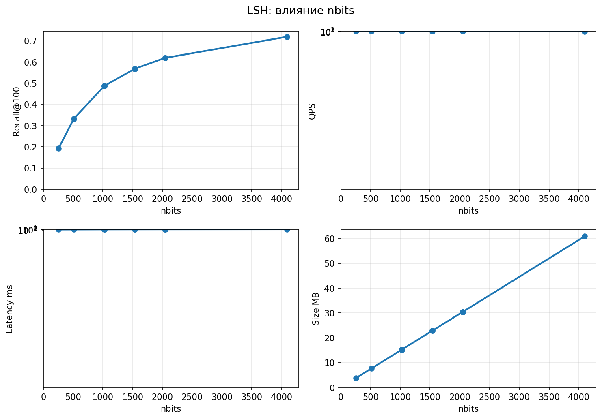

### IVF+PQ: влияние nlist
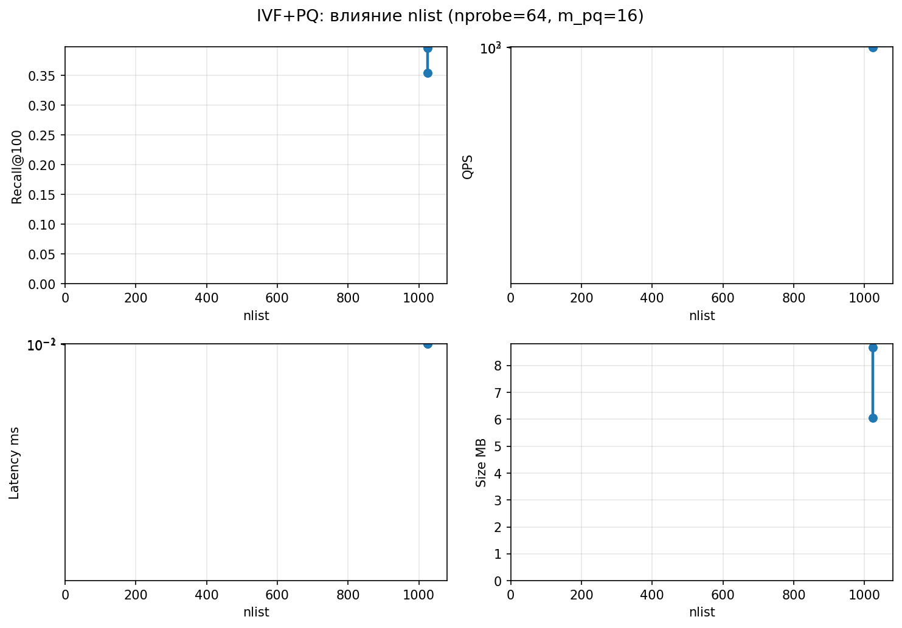

### IVF+PQ: влияние nprobe
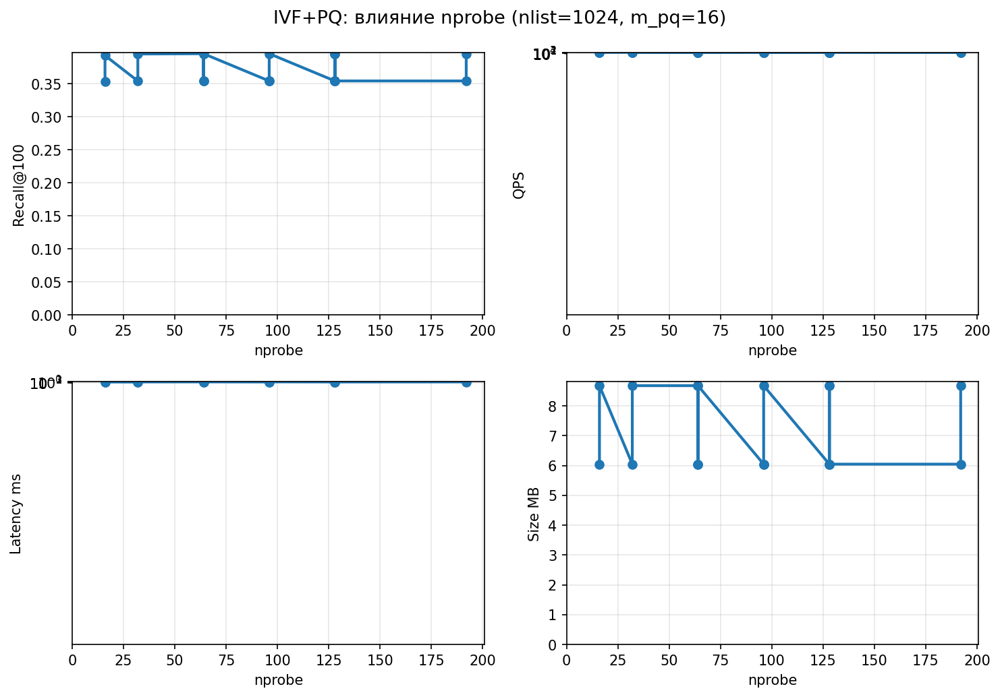

### IVF+PQ: влияние m_pq
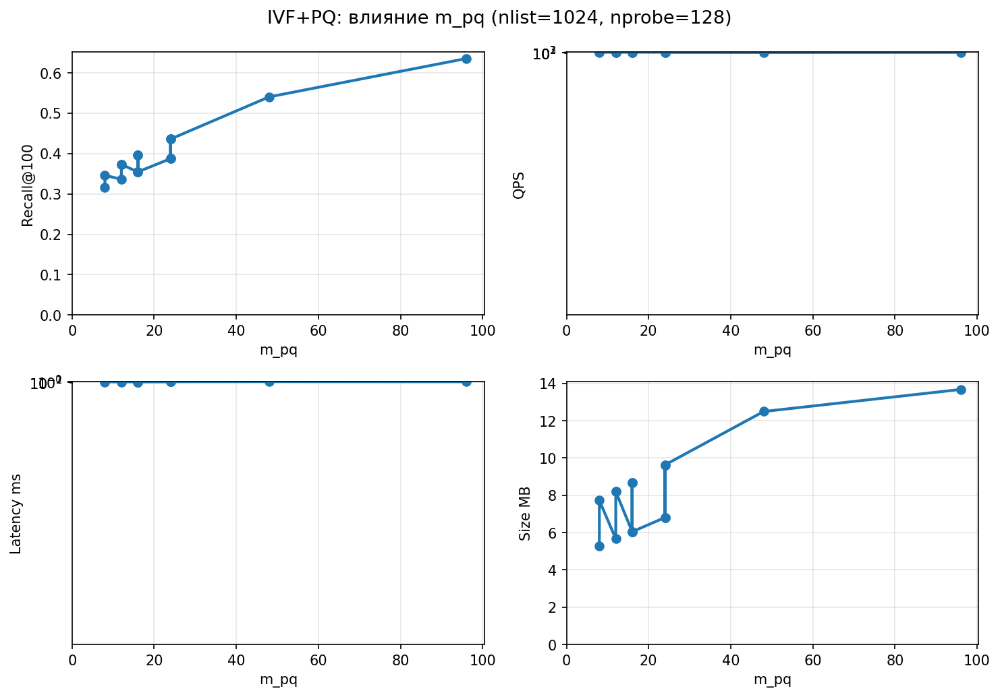

### IVF+PQ: влияние pq_bits
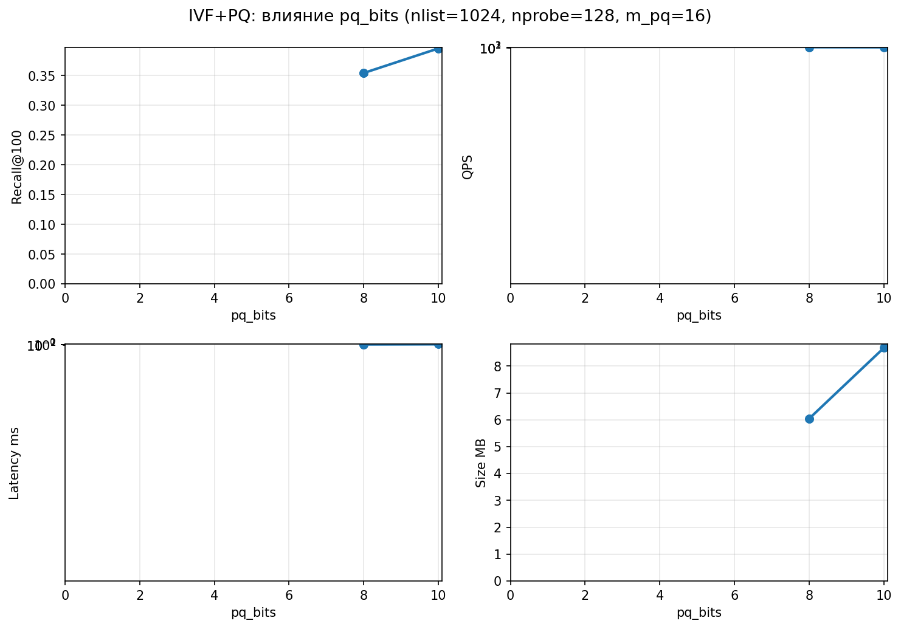

### IVF+PQ: heatmap recall (m_pq x nprobe)
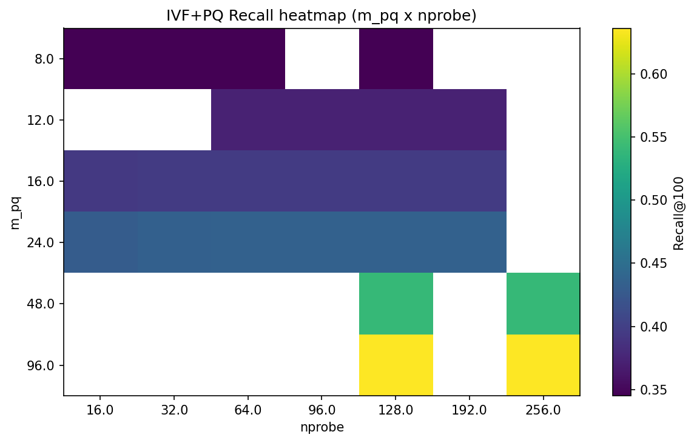

### IVF Flat: влияние nprobe
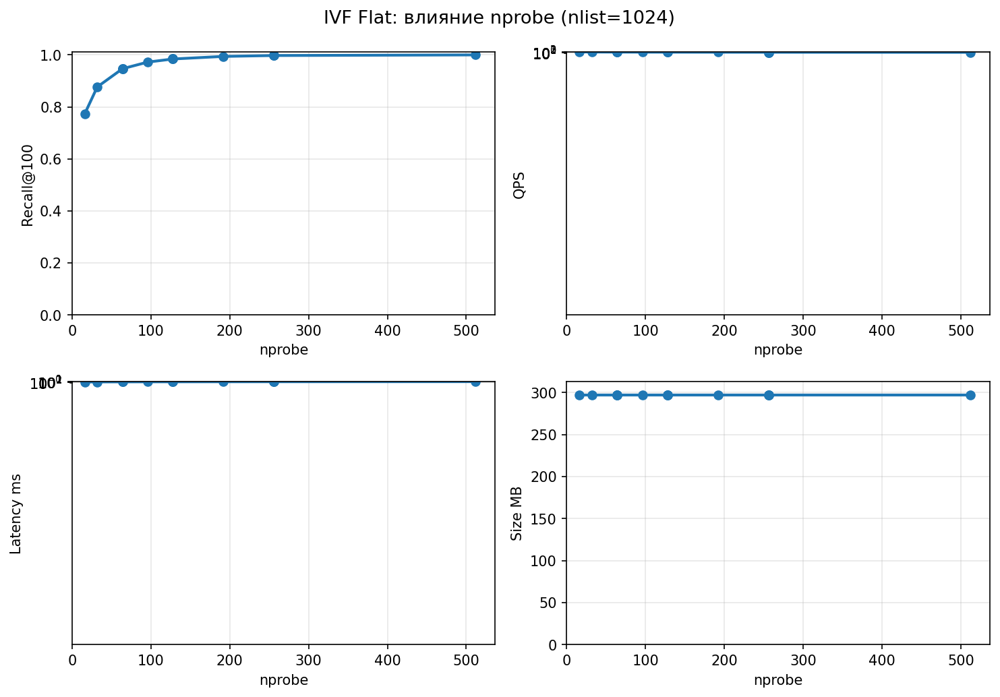
