# Отчёт: лабораторная 4

## Идея и структура

Хеш-таблица с закрытой адресацией (цепочки в бакете) — stripe locks; при росте числа бакетов число полос может увеличиваться (удвоение после порога bucketCount не менее 8× текущего числа полос, вплоть до 4096).

`Clear` сбрасывает к стартовому размеру.
`Get` обходит цепочку по снимку массива бакетов без read-lock на каждый вызов;
`Put`/`Merge` и resize/clear по-прежнему используют `ReaderWriterLockSlim`.
Поля связей и значений в узле публикуются через `Volatile`.

## Память и узкие места

- Массив бакетов + объекты узлов на куче GC; высокий churn увеличивает давление GC.
- Длинные цепочки при плохом распределении хешей ухудшают локальность кэша.
- Глобальный writer-lock на resize делает паузы заметнее, чем у `ConcurrentDictionary`/JDK CHM (`make profile-put`, Speedscope).

## Соответствие и отличия от JDK ConcurrentHashMap

- Per-key happens-before для завершённой записи и последующего `Get` при условии корректной публикации `value` (`Volatile`).
- `Size`: число маппингов в духе агрегатных методов CHM — надёжно при отсутствии конкурирующих записей; под гонкой значение переходящее.
- Итератор: weakly consistent — под read-lock собирается снимок пар ключ–значение в список, затем отдаётся наружу без удержания блокировки между элементами (изменения после снимка не видны).
- Resize ~0.75: упрощённая глобальная фаза под write-lock — отклонение от JDK transfer без блокировки retrieval на всём интервале.

## Характеристики устройства

12th Gen Intel Core i5-1240P 1.70GHz, 1 CPU, 16 logical and 12 physical cores

// BenchmarkDotNet v0.14.0
// Runtime=.NET 10.0.5 (10.0.526.15411), X64 RyuJIT AVX2
// GC=Concurrent Workstation
// HardwareIntrinsics=AVX2,AES,BMI1,BMI2,FMA,LZCNT,PCLMUL,POPCNT,AvxVnni,SERIALIZE VectorSize=256

## Бенчмарки: методика

Прогон: `make bench-report` (или `make bench` + `make graphs`).

| Параметр | Значение |
|----------|----------|
| `keySpace` | 16384 (таблица сразу с ёмкостью под все ключи бенча) |
| `opsPerInvocation` | 65536 |
| `threadCounts` | 1, 2, 4, 8, 16 (без 32/64 — т.к. 16 logical CPU) |
| warmup / iterations | 5 / 20 |

Сравниваются Hw4.ConcurrentMap и .NET `ConcurrentDictionary`. Ось Y на графиках — среднее время всей итерации (мс); при росте `Threads` объём работы фиксирован.

Таблицы и PNG: [`figures/summary_tables.md`](figures/summary_tables.md).

---

## Сводные графики

### Сравнение операций при T=1

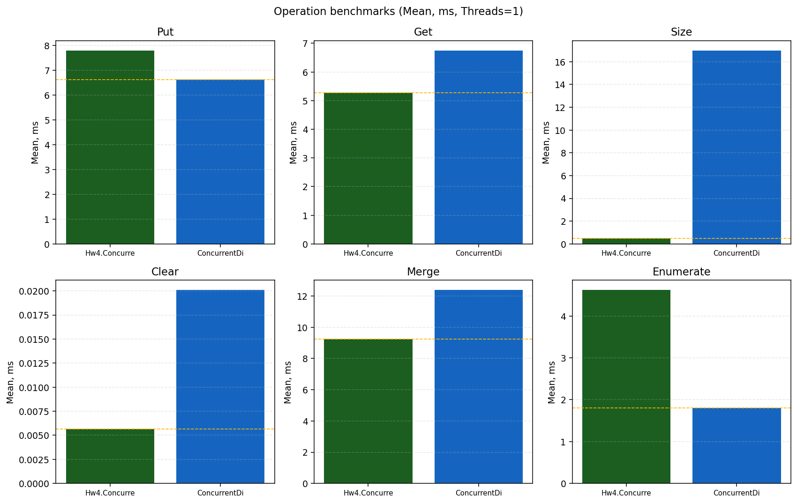

Подпись: Put, Get, Size, Clear, Merge, Enumerate — зелёный Custom, синий ConcurrentDict.

Вывод при T=1: быстрее CD на Put и Enumerate; быстрее Custom на Get, Merge, Size, Clear. Картина отличается от старого прогона, где Merge и Get при T=1 проигрывали.

### Масштабирование по потокам (T≤16)

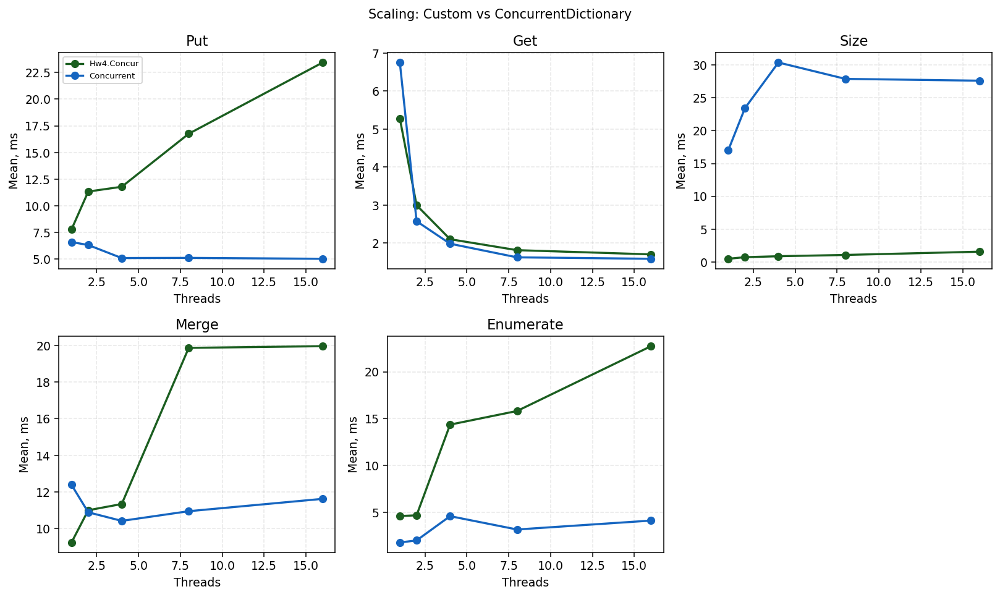

| Операция | Custom (T=1 → T=16) | ConcurrentDict | Почему расхождение |
|----------|---------------------|----------------|-------------------|
| Put | 7.8 → 23.4 ms | 6.6 → 5.0 ms | RW-lock + stripe + resize; CD масштабируется вниз. |
| Get | 5.3 → 1.7 ms | 6.8 → 1.6 ms | Lock-free `Get`; при T≥2 Custom ≈ CD или лучше. |
| Size | 0.48 → 1.6 ms | 17 → 28 ms | Атомарный счётчик vs тяжёлый `Count`. |
| Merge | 9.2 → 20.0 ms | 12.4 → 11.6 ms | При T=1 выигрыш Custom; с T=8 снова проигрыш из‑за contention. |
| Enumerate | 4.6 → 22.7 ms | 1.8 → 4.1 ms | Параллельный полный обход × repeats; снимок в `List`. |

### Отношение Custom / ConcurrentDict (T=1)

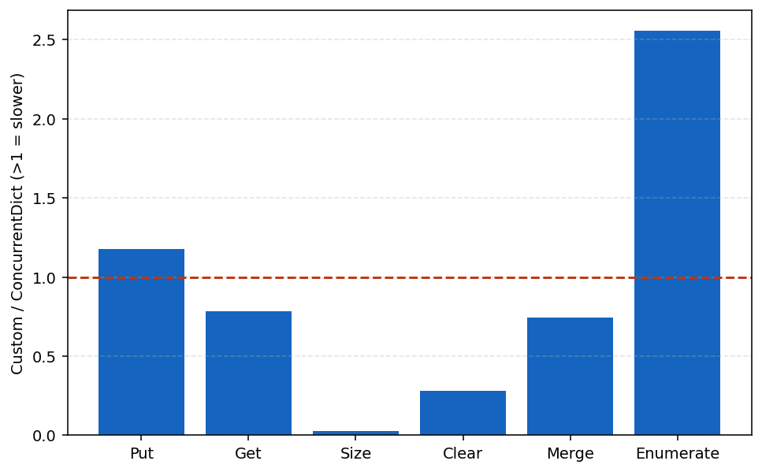

Столбцы < 1: Get, Size, Clear, Merge. > 1: Put, Enumerate.

### Пиковая нагрузка (T=16)

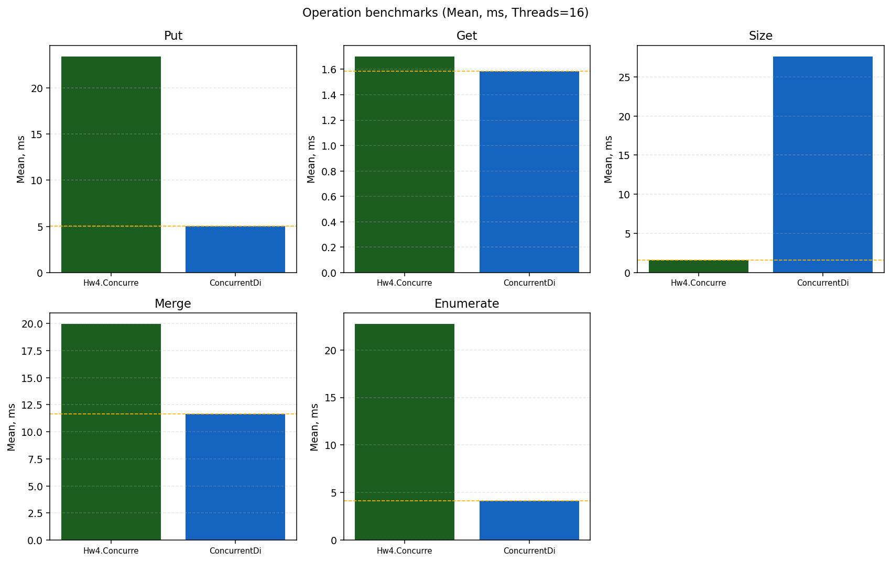

При 16 потоках Custom выигрывает только Size (и частично Clear); Put/Merge/Enumerate заметно медленнее CD.

---

## Put

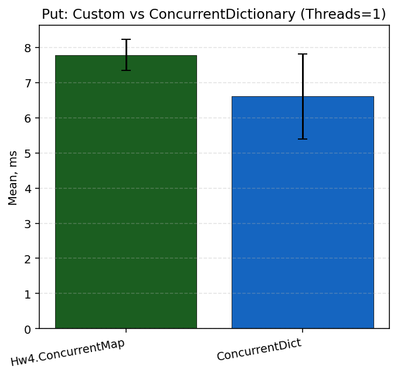

T=1: Custom 7.79 ms, CD 6.61 ms (1.18×). Было 7.75 / 5.36 (1.45×) — сближение, но CD на старом прогоне был быстрее в абсолютных цифрах из‑за меньшей таблицы.

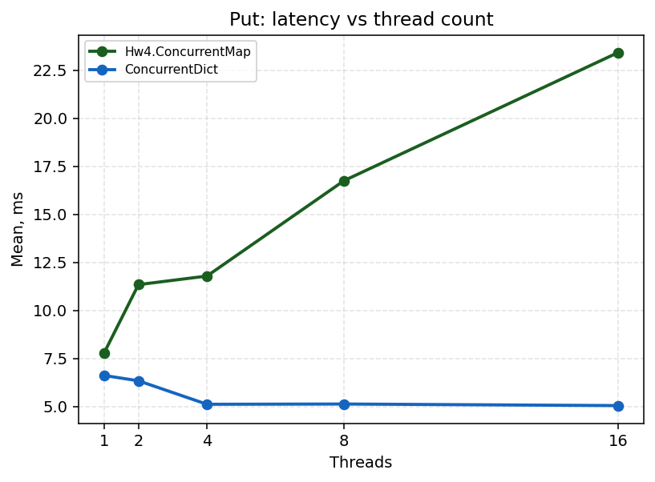

Почему Custom растёт до 23 ms при T=16: очереди на `lock(stripe)`, паузы resize под `EnterWriteLock`. Почему CD падает к ~5 ms: мелкие критические секции, нет нашего глобального write-lock на весь resize.

---

## Get

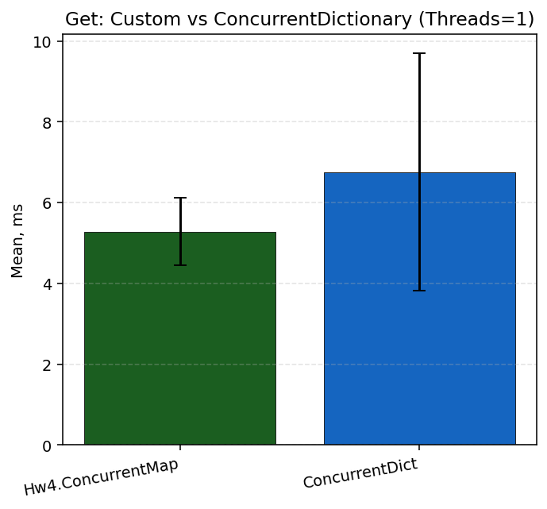

T=1: Custom 5.28 ms, CD 6.75 ms — быстрее на ~22% (раньше проигрывали 6.13 vs 5.36 ms).

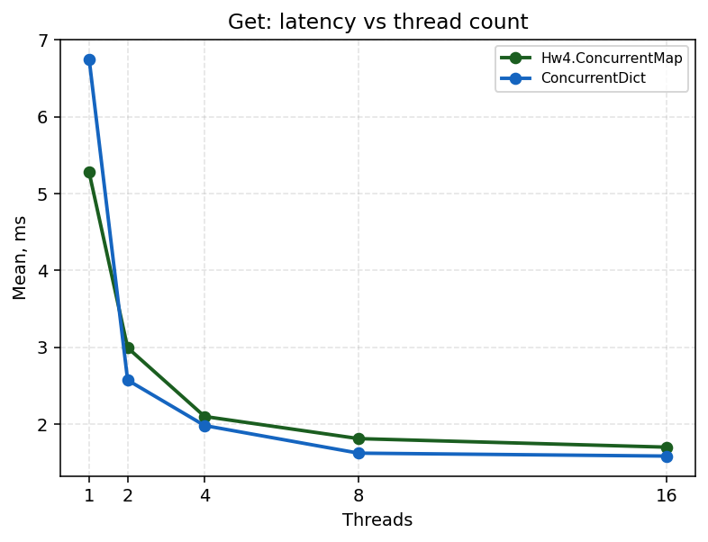

T=16: Custom 1.70 ms, CD 1.59 ms — паритет. Lock-free обход цепочки без `EnterReadLock` на каждый вызов; больший keySpace → более длинные цепочки, но меньше resize-шума в соседних бенчах.

---

## Size

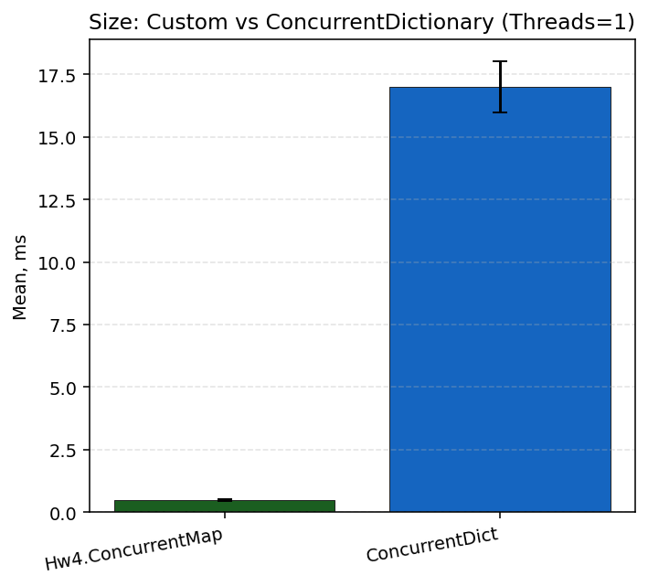

T=1: 0.48 ms vs 17.0 ms (~35× быстрее). `Size` = `Interlocked.Read(_mappingCount)`.

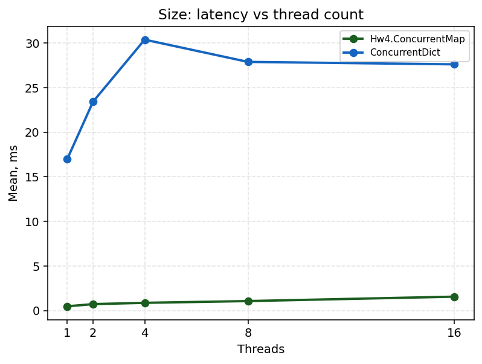

Custom остаётся в пределах ~1.6 ms; CD 17–30 ms и растёт с T.

---

## Clear

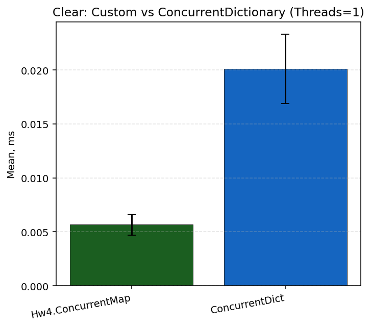

T=1: 5.7 µs vs 20.1 µs (0.28×). Один проход под write-lock без удаления узлов по одному.

---

## Merge

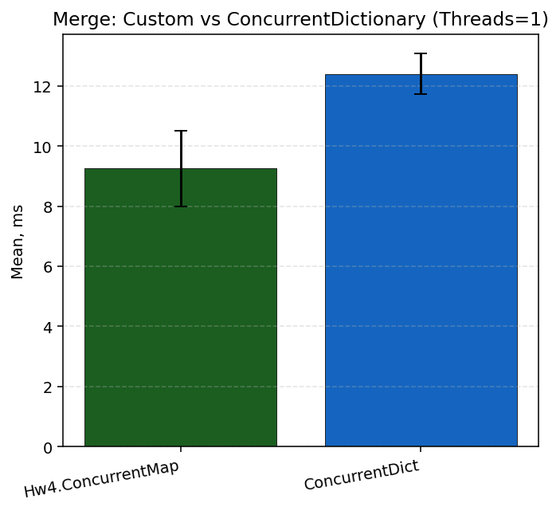

T=1: Custom 9.25 ms, CD 12.39 ms (0.75× — быстрее). Старый прогон: 20.3 vs 17.5 ms (проигрыш) — с keySpace 4096 было больше resize и конкуренции при предзаполнении.

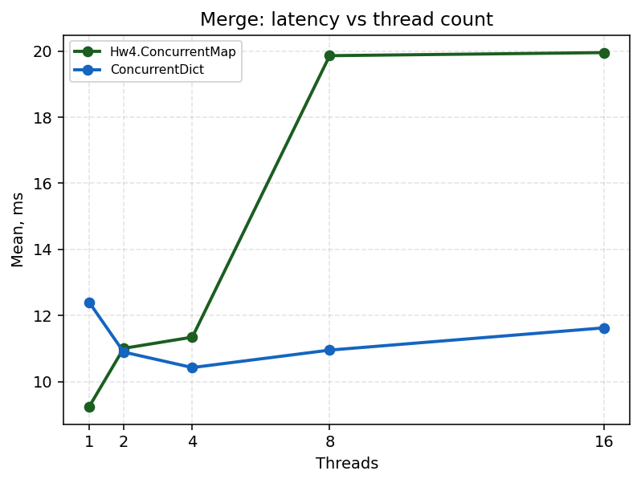

T=8–16: Custom ~20 ms, CD ~11 ms — снова проигрыш: read-modify-write под тем же lock, что Put; потоки бьют в общий keySpace.

Почему при T=1 лучше, при T=16 хуже: при одном потоке меньше блокировок; при 16 — contention на полосах и строковый `merger` (конкатенация).

---

## Enumerate

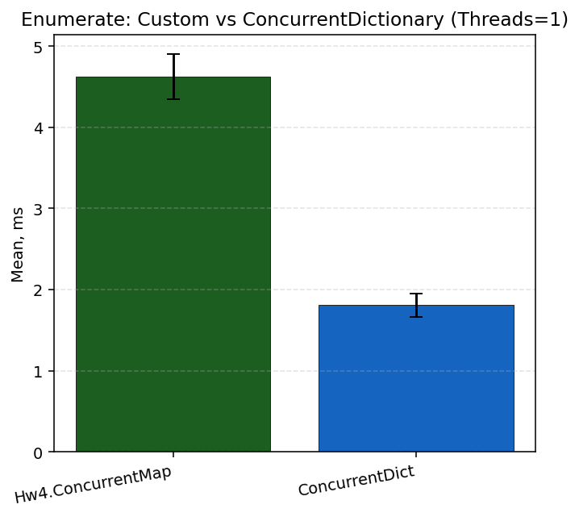

T=1: Custom 4.62 ms, CD 1.81 ms (2.56× медленнее). Снимок под read-lock в `List`.

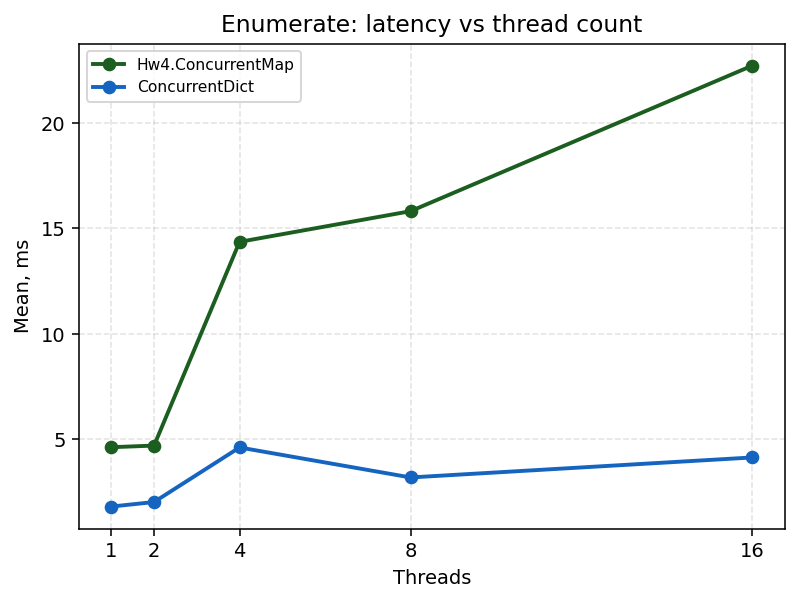

T=16: Custom 22.7 ms, CD 4.1 ms (было при T=64: 63.8 vs 25.5 ms — старый прогон с oversubscription и 64 потоками). Рост Custom с T=4 (14 ms) — параллельные полные обходы (`repeats = ops/keySpace = 4`).

---

## Гипотезы

| # | Гипотеза | Результат |
|---|----------|-----------|
| 1 | Lock-free Get ближе к CD | Да — при T=1 уже быстрее; при T≥2 паритет |
| 2 | Картина меняется с увеличением количества потоков | Да — Merge: лидер Custom только при T=1 |
| 3 | Запись + resize даёт хвосты | Да — Put 7.8→23.4 ms; Merge плато ~20 ms при T≥8 |

## Инструментарий тестирования

- **Coyote**: `CoyoteConcurrencyTests` — `coyote rewrite` (README).
- **Stress**: `make stress`.

---

## Профилирование (CPU flame graph)

профиль **`dotnet-sampled-thread-time`**, артефакты в `reports/profiles/`

```powershell
make profile-put      # hw4-put.speedscope.json
make profile-merge
make profile-get
```

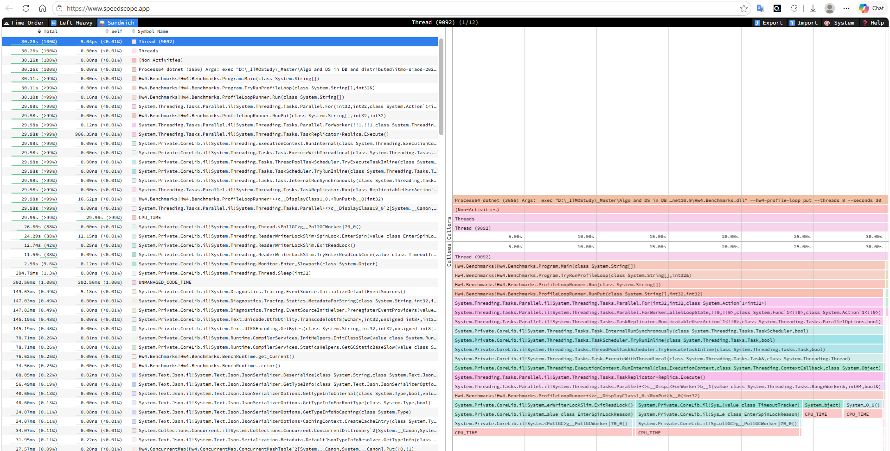

[speedscope.app](https://www.speedscope.app/) 

Текст: `hw4-put-topN.txt`.

На flame graph для **Put/Merge** ожидаются: `ReaderWriterLockSlim`, `Monitor.Enter`, `ConcurrentHashTable.Put` / `Resize`. Для **Get** — обход цепочки без read-lock на каждый вызов.

См. [`reports/profiles/README.md`](profiles/README.md).

---

## Воспроизведение

```text
make bench-report
```

Графики: [`reports/figures/`](figures/).