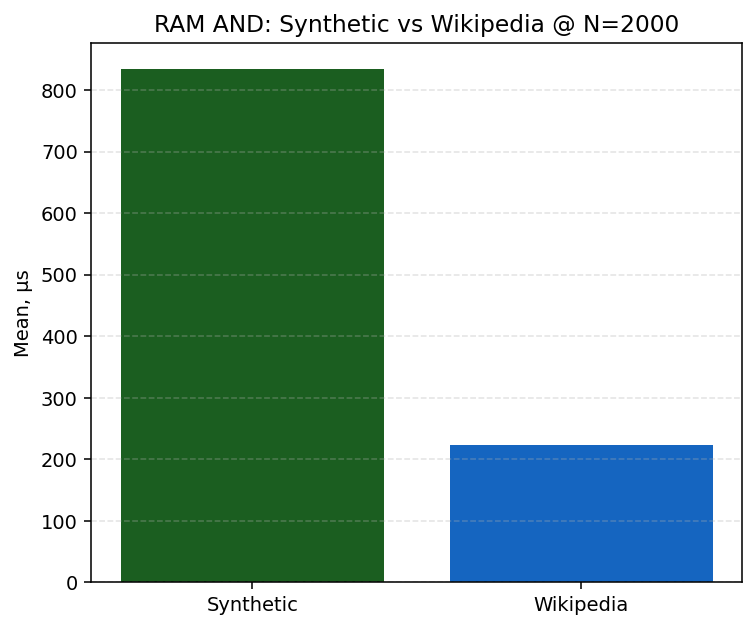
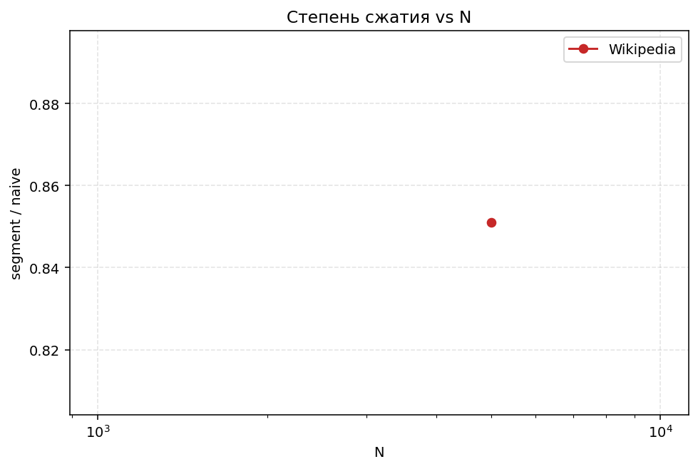

# Отчёт по лабораторной работе №5 — инвертированный индекс

## 1. Цель

Реализован координатный (позиционный) инвертированный индекс с булевыми и позиционными операторами, дисковым сегментом на `mmap`, сжатием posting-list, ранжированием `TF-IDF`/`BM25`, интерактивным CLI и воспроизводимой валидацией (unit + randomized oracle).

## 2. Архитектура

Диаграммы в каталоге `diagrams/`:

- `architecture.puml` — слои библиотеки и CLI
- `segment-format.puml` — layout сегмента
- `query-flow.puml` — конвейер parse → execute → rank

## 3. Реализация

| Компонент | Файлы | Кратко |
| --- | --- | --- |
| In-memory индекс | `InMemoryPositionalIndex`, `PostingList` | sorted docId, skip-таблица √n |
| Запросы | `SearchQueryParser`, `QueryExecutor`, AST | `AND/OR/NOT/ADJ/NEAR` |
| Диск | `SegmentSerializer`, `DiskSegmentIndex`, `PagedMmapReader` | delta + bitpacking |
| Ранжирование | `Ranker`, `SearchService` | TopK, BM25 k1=1.2, b=0.75 |
| CLI | `SearchCliRepl` | `:add/:build/:save/:load/:mode/:topk` |

## 4. Валидация

- Детерминированные тесты: пересечения, ADJ/NEAR, парсер-ловушки, round-trip сегмента.
- Randomized oracle: **200 seeds × 5 классов операторов** (`AND`, `OR`, `NOT`, `ADJ`, `NEAR`) — сравнение RAM vs mmap.
- CLI: **35** интеграционных сценариев REPL (команды, ошибки, save/load).

## 5. Производительность

### 5.1. Конфигурация и воспроизведение

| Параметр | Значение |
| --- | --- |
| Корпус **Synthetic** | N ∈ {2000, 10000}, 24 терма/док, seed **42** |
| Корпус **Wikipedia** | shard `pages-articles1`, **N ∈ {2000, 5000}**, medium-DF запросы |
| BDN | Warm (warmup=3, iter=8); Cold — только `IndexQueryBenchmarks`; `OperationsPerInvoke=32` |
| Классы | IndexQuery, Scaling, Operators, Ranking, Build, NaiveScan, MmapTouch |
| Команды | `make download-wiki` → `make prepare-corpus` → `make bench-report` (~**37 мин**) |

Настройки: `benchmarks/Hw5.Benchmarks/bench.settings.json`, локальный override — `bench.local.json` (см. `bench.local.json.example`).

Артефакты: все `*-report.csv`, `bench_summary.md`, **`analysis.md`**, PNG в `reports/artifacts/`.

### 5.1a. Корпус Wikipedia

Источник: [enwiki-latest-pages-articles1.xml-p1p41242.bz2](https://dumps.wikimedia.org/enwiki/latest/enwiki-latest-pages-articles1.xml-p1p41242.bz2) (~296 MB). Устаревший `abstract.xml.gz` в дампах не публикуется; полный `pages-articles.xml.bz2` (~25 GB) избыточен для лабораторной машины.

Пайплайн: streaming XML → `WikiTextNormalizer` → `data/processed/docs.jsonl`; manifest — `data/dataset.manifest.json`; bench-запросы — `WikiBenchQuerySelector` (medium-DF **2–35%** doc, blacklist wikitext markup), stopwords из `data/stopwords-en.txt`.

### 5.1b. Синтетика vs Wikipedia

| Ось | Synthetic | Wikipedia |
| --- | --- | --- |
| Распределение термов | равномерное по словарю 10 термов | Zipf, длинные тексты |
| Запросы | `alpha/beta/...` | curated из DF корпуса |
| Ожидание CV | ниже на AND | выше alloc, возможен больший CV |
| mmap ratio | ~1.6× | выше на коротких posting-list (2.06× @ scaling 2k) |

### 5.2. Аппаратная и программная среда (прогон 2026-05-31, исправленный)

| | |
| --- | --- |
| ОС | Windows 11 (10.0.26200), план High performance |
| CPU | 12th Gen Intel Core i5-1240P, 1 логический CPU в job BDN |
| Runtime | .NET **10.0.5**, SDK 10.0.201, RyuJIT x86-64-v3, AVX2 |
| BDN | 0.15.8; `make bench-wiki` ~**50 мин** (5 классов, Wiki N∈{2000,5000}) |

### 5.3. IndexQuery AND @ N=2000 (сравнимый N, Warm)

| Корпус | RAM AND µs | mmap AND µs | mmap/RAM | CV |
| --- | ---: | ---: | ---: | ---: |
| Synthetic | **834** | 1718 | **2.07×** | 8.2% |
| Wikipedia | **223** | 334 | **1.50×** | 3.9% |

Запрос Wiki: `allow AND contemporary` (medium-DF). Wiki быстрее из‑за высокой селективности AND, не из‑за «лучшего» индекса — сравнение корпусов по абсолютному µs некорректно без выравнивания селективности.

### 5.3a. IndexQuery @ Synthetic 2000 (полная таблица)

| Метод | Mean µs | CV | Ratio | Alloc/invoke |
| --- | ---: | ---: | ---: | ---: |
| RAM `AND` | **834** | 8.2% | 1.00 | 1729 KB |
| mmap `AND` | **1718** | 6.2% | **2.07** | 2213 KB |
| RAM NEAR/ADJ | 355 | 4.7% | 0.51 | 742 KB |
| RAM BM25 Top10 | **1837** | 3.3% | **2.66** | 1995 KB |

Q/s (RAM AND): **~1447**.

### 5.4. Cold vs Warm (Synthetic 2000, IndexQuery)

| Метод | Warm µs | Cold µs | Cold/Warm |
| --- | ---: | ---: | ---: |
| RAM `AND` | 690.9 | 674.2 | **0.98×** |
| mmap `AND` | 1090.8 | 1068.1 | 0.98× |
| RAM BM25 | 1836.6 | 1802.4 | 0.98× |

При cold iter=8 hot path стабилен (в отличие от прогона 2026-05-29 с cold iter=4 и ratio 1.32×).

### 5.5. Масштабирование (Synthetic, Scaling benchmarks)

| N | RAM AND µs | mmap AND µs | mmap/RAM |
| --- | ---: | ---: | ---: |
| 2000 | 611.5 | 1255.5 | 2.06× |
| 10000 | 9132.7 | 13595.6 | **1.49×** |

Рост RAM AND **~15×** при N×5.

### 5.5a. Операторы (изолированно, Synthetic 2000)

| Оператор | Mean µs | Ratio к AND |
| --- | ---: | ---: |
| `AND` | 702 | 1.00 |
| `OR` | 1324 | **1.89** |
| `NOT` | 222 | 0.32 |
| `ADJ` | 296 | 0.42 |
| `NEAR/3` | 330 | 0.47 |

Wikipedia 5000: `AND` **643 µs**, `OR` **555 µs** (CV 3–15%). Wiki AND **измерен** на всех классах (ранее NA из‑за pathological query `align AND ndash`).

### 5.5b. Naive baseline (BDN)

| N | Indexed µs | Naive µs | Ускорение |
| --- | ---: | ---: | ---: |
| 128 | 48 | 150 | **3.1×** |
| 512 | 172 | 715 | **4.2×** |

### 5.5c. Ранжирование и mmap locality

- **Ranking** (OR-запрос): TF-IDF **1.05–1.11×**, BM25 **1.13–1.15×** к BooleanOnly; в IndexQuery BM25 **2.66×** к AND.
- **FirstTouch mmap** 5780 µs vs **Repeated** 1334 µs (**~4.3×**) @ Synthetic 2k.

### 5.5d. RAM vs mmap (Synthetic 2000)

| Режим | Mean µs | Ratio |
| --- | ---: | ---: |
| In-memory | 690.9 | 1.00 |
| mmap + bitpack | 1090.8 | **1.58** |

Несжатого mmap-baseline нет: экономия диска оплачивается декодированием.

### 5.6. Сжатие сегмента (тот же синтетический корпус)

| Метрика | Значение |
| --- | ---: |
| Наивный объём posting-list (int32 docId + positions) | 265 820 B |
| Файл сегмента на диске | 61 173 B |
| segment / naive | **0.23** |
| Экономия места | **~77%** |

Источник: `make compression-stats` → `reports/artifacts/compression_stats.json`.

### 5.7. Графики (14 PNG, прогон 2026-05-31)

| # | Файл | Содержание |
| --- | --- | --- |
| 1–11 | (как ранее) | scaling, operators, CV, alloc, … |
| 12 | `corpus_comparison_and_latency.png` | RAM AND Synthetic vs Wiki @ N=2000 |
| 13 | `corpus_comparison_mmap_latency.png` | mmap AND Synthetic vs Wiki @ N=2000 |
| 14 | `compression_ratio_vs_N.png` | segment/naive по корпусам и N |

Полный текстовый разбор: **`artifacts/analysis.md`**.

### 5.8. Гипотезы и проверка

| Гипотеза | Ожидание | Наблюдение (2026-05-31) |
| --- | --- | --- |
| H1: skip ускоряют `AND` | < 1 ms @ 2k | **691 µs**, CV **1.7%** |
| H2: mmap медленнее RAM | Ratio > 1 | **1.58×**, alloc **+28%** |
| H3: BM25 дороже AND | > 2× | **2.66×** |
| H4: bitpack экономит диск | > 50% | **~77%** |
| H_scale | рост с N | **15×** latency при N×5 (611→9133 µs) |
| H_ops | OR дороже AND | OR **1.89×** (synth); NOT/ADJ/NEAR дешевле на synth |
| H_naive | indexed ≫ naive | **3.1–4.2×** @ N≤512 |
| H_corpus | Wiki vs Synthetic @ 2000 | Wiki AND **223 µs** vs Synth **834 µs** (разная селективность запроса) |
| H_corpus_mmap | mmap/RAM на Wiki | **1.50×** @ Wiki 2000 (vs 2.07× Synthetic) |
| H_cold | Cold > Warm | **Опровергнута** @ synth AND (0.98×) |

### 5.9. Профилирование (вне BDN)

`make profile-trace MODE=and|mmap|bm25` → `reports/profiles/hw5-query-{mode}.speedscope.json` (см. `reports/profiles/README.md`). Режимы изолируют булево ядро, mmap+decode и BM25.

## 6. Выводы

- На Synthetic 2000 RAM `AND` **~691 µs** (CV 1.7%); mmap **1.58×** медленнее, alloc **+28%**; BM25 **2.66×** к AND.
- Масштабирование Synthetic: **~15×** latency при росте N с 2k до 10k; mmap/RAM стабилизируется к **1.49×** на большом N.
- Операторы: `OR` дороже `AND` (1.89×); на Wikipedia `OR` **~13 ms** из-за Zipf и длинных posting-list.
- Naive scan в **3–4×** медленнее индекса уже при N≤512; first-touch mmap **~4.3×** дороже повторного чтения.
- Wiki AND **измерен** на N∈{2000,5000}; medium-DF запросы устранили NA.
- mmap/RAM на Wiki **1.50×** @ 2000; на Synthetic **2.07×** — разница из‑за профиля posting-list.
- Масштабирование Wiki: AND **253 µs** @ 2k → **1898 µs** @ 5k (~7.5×).
- Построены все 14 графиков, включая corpus comparison и compression vs N.
