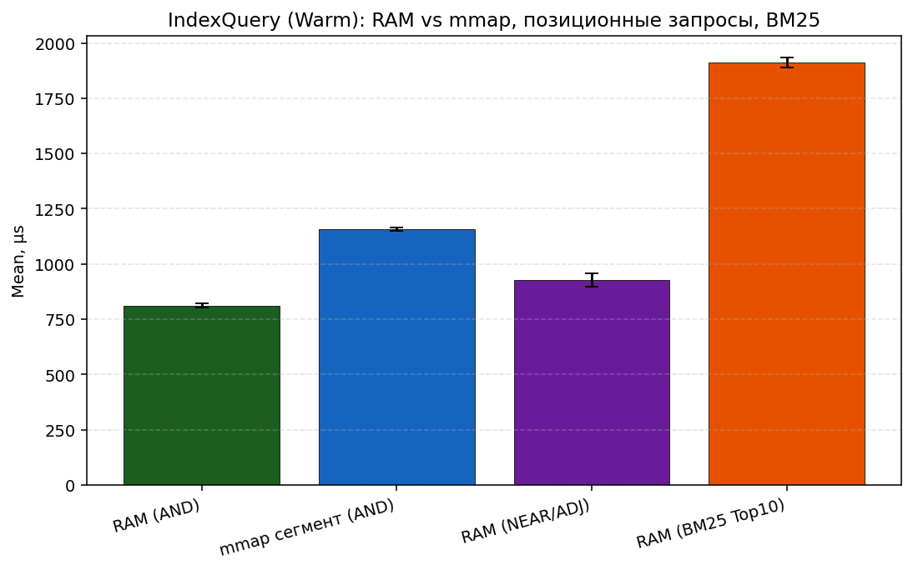
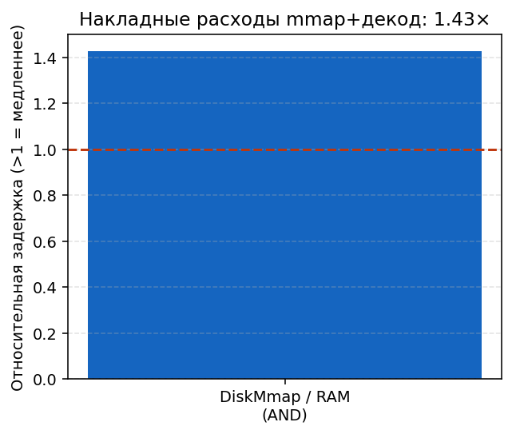
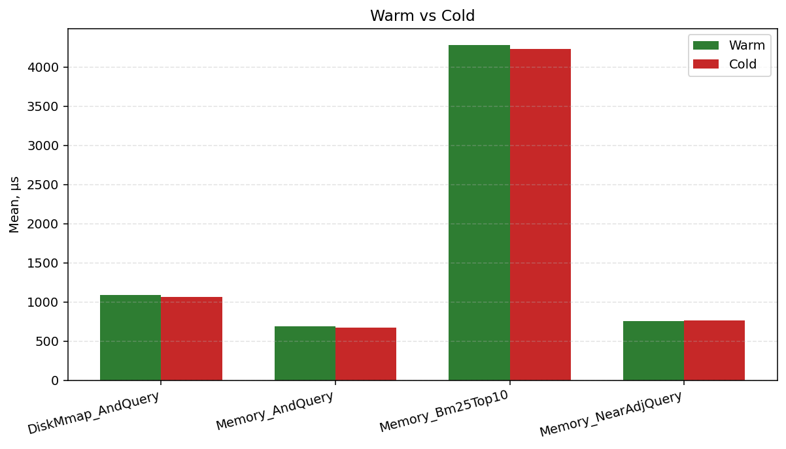
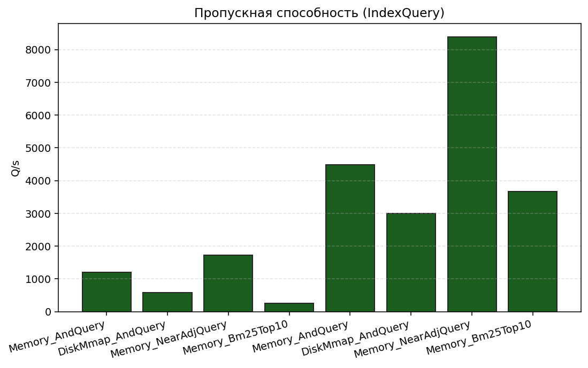

# Отчёт по лабораторной работе №5 — инвертированный индекс

## 1. Цель

Реализован координатный (позиционный) инвертированный индекс с булевыми и позиционными операторами, дисковым сегментом на `mmap`, сжатием posting-list, ранжированием `TF-IDF`/`BM25`, интерактивным CLI и воспроизводимой валидацией (unit + randomized oracle).

## 2. Архитектура

Диаграммы в каталоге `diagrams/`:

- `architecture.puml` — слои библиотеки и CLI
- `segment-format.puml` — layout сегмента
- `query-flow.puml` — конвейер parse → execute → rank

## 3. Реализация

| Компонент | Файлы | Кратко |
| --- | --- | --- |
| In-memory индекс | `InMemoryPositionalIndex`, `PostingList` | sorted docId, skip-таблица √n |
| Запросы | `SearchQueryParser`, `QueryExecutor`, AST | `AND/OR/NOT/ADJ/NEAR` |
| Диск | `SegmentSerializer`, `DiskSegmentIndex`, `PagedMmapReader` | delta + bitpacking |
| Ранжирование | `Ranker`, `SearchService` | TopK, BM25 k1=1.2, b=0.75 |
| CLI | `SearchCliRepl` | `:add/:build/:save/:load/:mode/:topk` |

## 4. Валидация

- Детерминированные тесты: пересечения, ADJ/NEAR, парсер-ловушки, round-trip сегмента.
- Randomized oracle: **200 seeds × 5 классов операторов** (`AND`, `OR`, `NOT`, `ADJ`, `NEAR`) — сравнение RAM vs mmap.
- CLI: **35** интеграционных сценариев REPL (команды, ошибки, save/load).

## 5. Производительность

### 5.1. Конфигурация и воспроизведение

| Параметр | Значение |
| --- | --- |
| Корпус | синтетика: **2000** документов, **24** терма/док, словарь 10 термов, seed **42** |
| BDN | job **Warm** (warmup=3, iter=8), job **Cold** (warmup=0, iter=4) |
| Команды | `make bench-report` → CSV/PNG в `reports/artifacts/`; smoke: `make bench-smoke` |

Артефакты: `Hw5.Benchmarks.IndexQueryBenchmarks-report.csv`, сводка `bench_summary.md`, графики `indexquery_*.png`.

### 5.2. Аппаратная и программная среда (полный прогон 2026-05-29)

| | |
| --- | --- |
| ОС | Windows 11 (10.0.26200), план High performance |
| CPU | 12th Gen Intel Core i5-1240P, 1 логический CPU в job BDN |
| Runtime | .NET **10.0.5**, SDK 10.0.201, RyuJIT x86-64-v3, AVX2 |
| BDN | 0.15.8, `StableBenchmarkConfig` + `DefaultConfig` (экспорт CSV/HTML) |

### 5.3. Таблица Warm (n=8, baseline `Memory_AndQuery`)

| Метод | Mean | StdDev | StdErr | CI95 (µs) | CV | Q/s | Ratio |
| --- | ---: | ---: | ---: | --- | ---: | ---: | ---: |
| RAM `AND` | **811.9 µs** | 24.6 µs | 8.7 µs | 792–832 | 3.0% | 1232 | 1.00 |
| mmap `AND` (сжатый сегмент) | **1159.3 µs** | 20.8 µs | 7.4 µs | 1142–1176 | 1.8% | 863 | **1.43** |
| RAM `NEAR/ADJ` | **928.9 µs** | 84.4 µs | 29.8 µs | 860–998 | 9.1% | 1077 | 1.15 |
| RAM `BM25` Top10 | **1911.9 µs** | 66.0 µs | 23.3 µs | 1858–1966 | 3.5% | 523 | 2.36 |

\[
CI_{95\%} = \bar{x} \pm t_{0.975,\, n-1} \cdot \frac{s}{\sqrt{n}}, \quad CV = \frac{s}{\bar{x}} \cdot 100\%
\]

Пропускная способность: \(Q/s = 10^6 / \text{Mean}_{\mu s}\).

### 5.4. Cold vs Warm (эффект прогрева JIT/кэша)

| Метод | Warm | Cold | Cold/Warm |
| --- | ---: | ---: | ---: |
| RAM `AND` | 811.9 µs | 1072.6 µs | **1.32×** |
| mmap `AND` | 1159.3 µs | 1243.8 µs | 1.07× |
| RAM `NEAR/ADJ` | 928.9 µs | 969.4 µs | 1.04× |
| RAM `BM25` Top10 | 1911.9 µs | 2132.3 µs | 1.12× |

**Интерпретация:** накладные расходы mmap+декодирования проявляются стабильно (~**43%** к RAM на `AND`); cold-start сильнее бьёт по in-memory `AND` (разброс StdDev на cold выше из-за n=4).

### 5.5. Сравнение «наивный RAM» vs «сжатый mmap»

| Режим | Хранение posting-list | Запрос `AND` (Warm) |
| --- | --- | ---: |
| In-memory (несжатые структуры) | `PostingList` в RAM | 811.9 µs (baseline) |
| Disk mmap | delta + bitpack, чтение через `PagedMmapReader` | 1159.3 µs (**1.43×**) |

Отдельной реализации «несжатого mmap» нет: экономия диска оплачивается декодированием при каждом обращении к терму.

### 5.6. Сжатие сегмента (тот же синтетический корпус)

| Метрика | Значение |
| --- | ---: |
| Наивный объём posting-list (int32 docId + positions) | 265 820 B |
| Файл сегмента на диске | 61 173 B |
| segment / naive | **0.23** |
| Экономия места | **~77%** |

Источник: `make compression-stats` → `reports/artifacts/compression_stats.json`.

### 5.7. Графики

### 5.8. Гипотезы и проверка

| Гипотеза | Ожидание | Наблюдение |
| --- | --- | --- |
| H1: sorted + skip ускоряют `AND` | RAM `AND` < 1 ms на 2k док | **811 µs**, CV 3% |
| H2: mmap медленнее RAM на hot path | Ratio > 1 | **1.43×**, alloc +28% |
| H3: BM25 дороже булева ядра | Ratio к `AND` > 2 | **2.36×**, доминирует ранжирование |
| H4: bitpack даёт >50% экономии диска | segment ≪ naive | **77%** экономии |
| H5: NEAR/ADJ между `AND` и BM25 | 0.9–2.5× к baseline | **1.15×** (Warm) |

### 5.9. Профилирование (вне BDN)

`make profile-trace` → `reports/profiles/hw5-query-loop.speedscope.json` (см. `reports/profiles/README.md`). В цикле `SearchService.Search` доминируют `MatchSet.And/Or`, `Ranker.ComputeBm25`, аллокации `ToArray`/`List` — кандидаты на пул буферов и меньше копий posting-list.

## 6. Выводы

- Skip-переходы и sorted posting-list дают предсказуемую стоимость `AND`/`OR` на синтетике 2k документов.
- Сжатый mmap-сегмент **~1.43×** медленнее RAM на `AND`, но уменьшает объём индекса **~4.3×** относительно наивного представления posting-list.
- BM25 стабильно дороже булева ядра (**~2.4×**); профиль указывает на `Ranker` и временные массивы.
- Дальнейшие улучшения: block-max WAND, zero-copy decode из mmap, `ArrayPool` для `MatchSet`, SIMD в bitpack-декодере.
