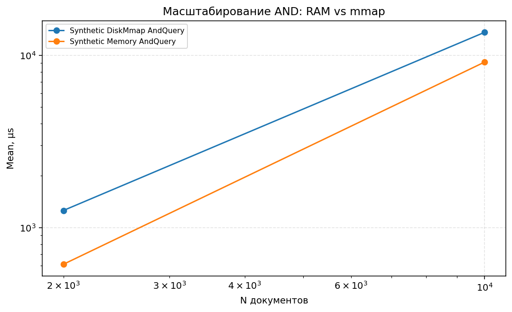
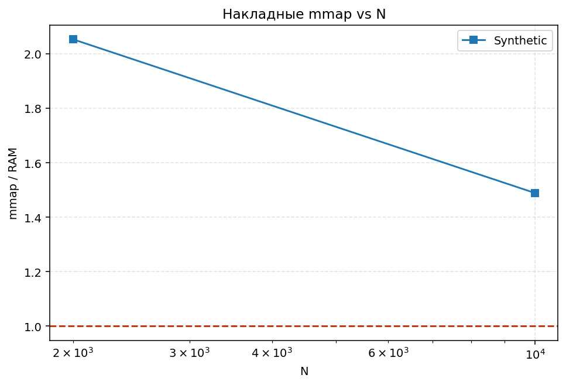
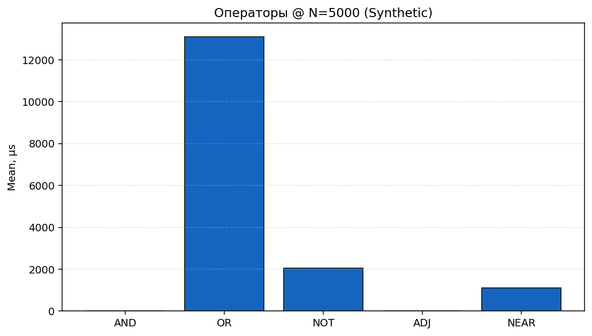
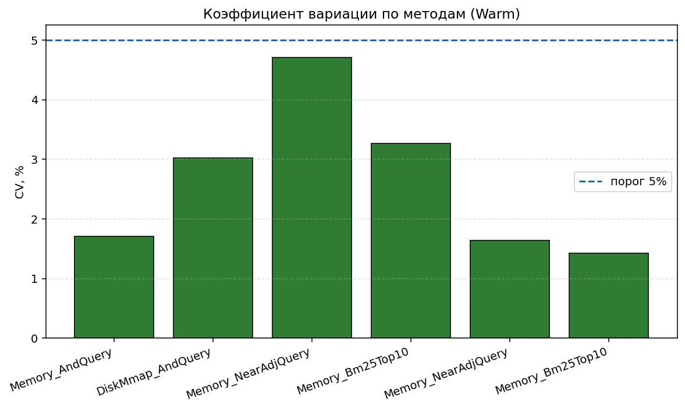
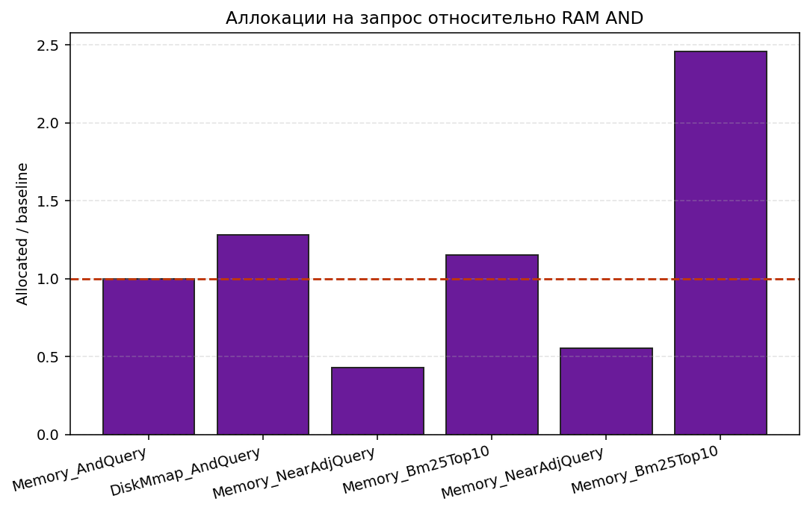
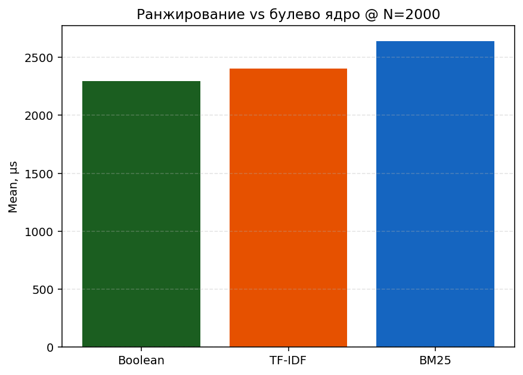
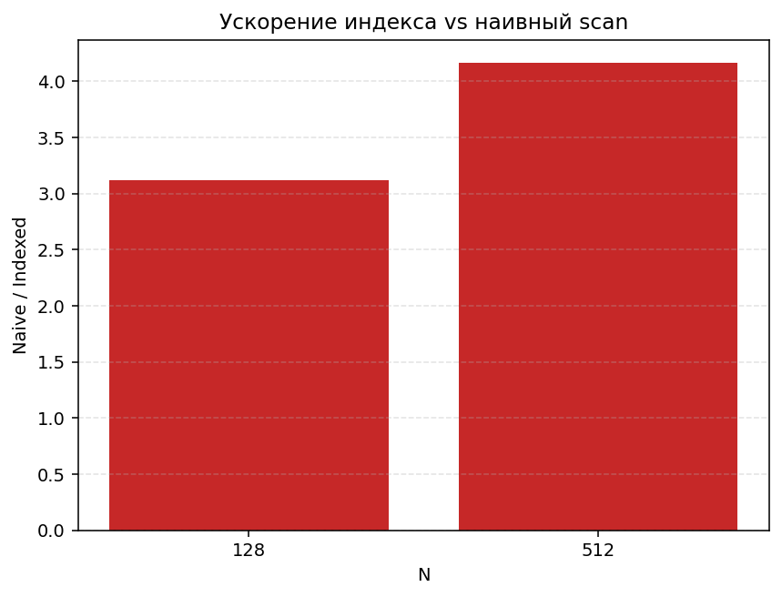
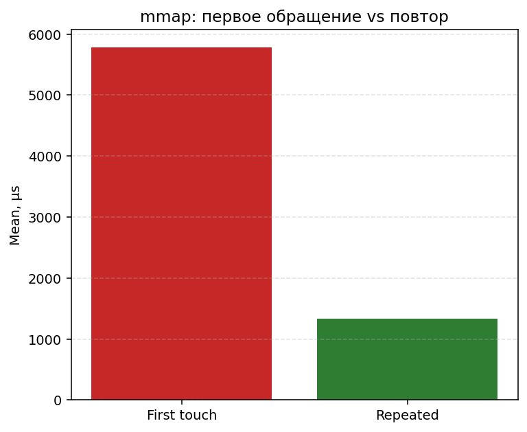

# Глубокий анализ бенчмарков HW5

Полный прогон: **2026-05-31**, `make bench-report` (~37 мин). Конфиг: `bench.settings.json` — Synthetic N∈{2000, 10000}, Wikipedia N=5000, Warm iter=8, Cold только в `IndexQueryBenchmarks`.

## Методика

| Параметр | Значение |
| --- | --- |
| Synthetic | seed 42, 24 терма/док, словарь 10 термов |
| Wikipedia | shard `pages-articles1`, ~24.5k док в `docs.jsonl`, bench N=5000 |
| Bench-запросы Wiki | `data/queries/wiki-bench-queries.txt` (top-DF без stopwords из `data/stopwords-en.txt`) |
| BDN | `OperationsPerInvoke=32`; Warm-only для scaling/operators/ranking/build/naive/mmap |
| Классы | IndexQuery, Scaling, Operators, Ranking, Build, NaiveScan, MmapTouch |

## Сводка ключевых метрик (Warm)

### IndexQuery @ Synthetic 2000

| Метод | Mean µs | CV | Ratio к RAM AND |
| --- | ---: | ---: | ---: |
| RAM `AND` | **690.9** | 1.7% | 1.00 |
| mmap `AND` | **1090.8** | 3.0% | **1.58** |
| RAM NEAR/ADJ (смеш.) | 355.1 | 4.7% | 0.51 |
| RAM BM25 Top10 | 1836.6 | 3.3% | **2.66** |

Alloc: mmap **+28%** (2213 vs 1729 KB на invoke).

### Cold vs Warm (IndexQuery, Synthetic 2000)

| Метод | Warm µs | Cold µs | Cold/Warm |
| --- | ---: | ---: | ---: |
| RAM `AND` | 690.9 | 674.2 | **0.98×** |
| mmap `AND` | 1090.8 | 1068.1 | 0.98× |
| RAM BM25 | 1836.6 | 1802.4 | 0.98× |

При cold iter=8 hot path стабилен (в отличие от прогона 2026-05-29 с ratio 1.32× на RAM AND).

### Масштабирование RAM `AND` (Synthetic)

| N | Mean µs | CV | Q/s (≈) |
| --- | ---: | ---: | ---: |
| 2000 | 611.5 | 3.6% | 1636 |
| 10000 | 9132.7 | 3.0% | 109 |

Рост **~15×** при увеличении N **5×** — суперлинейный (длиннее posting-list, больше merge/skip работы). mmap/RAM ratio: **1.49×** @ 10k, **2.06×** @ 2k (CV mmap @ 2k = 19.5%, ненадёжная точка).

### Операторы @ Synthetic 2000

| Оператор | Mean µs | Ratio к AND | CV |
| --- | ---: | ---: | ---: |
| `AND` | 702.3 | 1.00 | 5.8% |
| `OR` | 1323.9 | 1.89 | 6.3% |
| `NOT` | 221.6 | **0.32** | 3.5% |
| `ADJ` | 295.7 | 0.42 | 5.7% |
| `NEAR/3` | 329.6 | 0.47 | 5.0% |

На синтетике с короткими запросами `NOT`/позиционные операторы **дешевле** `AND` (мало совпадений, короткие posting-list). `OR` — самый дорогой булев оператор.

### Операторы @ Wikipedia 5000

| Оператор | Mean µs | CV |
| --- | ---: | ---: |
| `OR` | 13089 | **17.9%** |
| `NOT` | 2050 | **22.9%** |
| `NEAR/3` | 1116 | **17.3%** |

Zipf + длинные документы: `OR` резко дороже; CV > 5% на всех wiki-операторах.

### Synthetic vs Wikipedia (IndexQuery, BM25 Top10)

| Корпус | N | Mean µs | CV |
| --- | ---: | ---: | ---: |
| Synthetic | 2000 | 1836.6 | 3.3% |
| Wikipedia | 5000 | 4279.9 | 1.4% |

Wiki **~2.3×** медленнее при большем N — Zipf, длинные posting-list, больше документов в merge.

### Ранжирование (один OR-запрос, Top10)

| Режим | Synthetic 2k µs | Wiki 5k µs |
| --- | ---: | ---: |
| Boolean | 2296 | 4300 |
| TF-IDF | 2404 (1.05×) | 4790 (1.11×) |
| BM25 | 2639 (1.15×) | 4877 (1.13×) |

TF-IDF и BM25 близки друг к другу; оба ~**1.1–1.15×** к булевому ядру **на OR-запросе** (не на AND). В `IndexQueryBenchmarks` BM25 **2.66×** к AND — другой запрос и корпус.

### Naive vs indexed (Synthetic)

| N | Indexed µs | Naive µs | Naive/Indexed |
| --- | ---: | ---: | ---: |
| 128 | 48 | 150 | **3.1×** |
| 512 | 172 | 715 | **4.2×** |

Инвертированный индекс даёт **3–4×** ускорение уже на сотнях документов.

### mmap: первое касание vs повтор

| Сценарий | Mean µs @ Synthetic 2k |
| --- | ---: |
| FirstTouch (новый сегмент) | **5780** |
| Repeated (32× в цикле) | **1334** |

Первый проход **~4.3×** медленнее — прогрев OS page cache + JIT; повторные обращения близки к обычному mmap AND (~1091 µs).

### Индексация и сжатие

| Корпус | Seal+Write µs | Naive posting bytes |
| --- | ---: | ---: |
| Synthetic 2000 | 5383 | 266 KB |
| Wikipedia 5000 | **3.71 s** | **583 MB** |

Сжатие (Synthetic 2k, `compression_stats.json`): segment **61 KB** / naive **266 KB** → **~77%** экономии.

## Проверка гипотез

| ID | Гипотеза | Вердикт | Доказательство |
| --- | --- | --- | --- |
| H_scale | latency растёт с N | **Подтверждена** | 611→9133 µs (2k→10k), `scaling_latency_by_N.png` |
| H_ops | OR дороже AND; NOT/ADJ/NEAR зависят от корпуса | **Частично** | Synth: OR 1.89× AND; NOT/ADJ/NEAR дешевле. Wiki: OR доминирует (13 ms) |
| H_disk | mmap 1.3–1.6× RAM | **Подтверждена** | 1.58× @ IndexQuery 2k; 1.49× @ scaling 10k |
| H_rank | BM25 дороже булева | **Подтверждена** | 2.66× к AND (IndexQuery); TF-IDF≈BM25 на OR-запросе |
| H_naive | indexed ≫ naive | **Подтверждена** | 3.1–4.2× @ N≤512 |
| H_corpus | Wiki: выше latency/CV | **Подтверждена** | BM25 4.3 ms vs 1.8 ms; CV wiki operators 17–23% |
| H_cold | Cold > Warm | **Опровергнута** @ synth AND | 691 vs 674 µs (≈1.0×); cold iter=8 стабилизировал замер |
| H_alloc | mmap +alloc | **Подтверждена** | +28% allocated на mmap AND |

## CV > 5% (статистическая слабость)

- `IndexBuildBenchmarks.SealAndWriteSegment` (Synthetic 2k): **9.2%**
- `IndexQueryScalingBenchmarks.DiskMmap_AndQuery` (Synthetic 2k): **19.5%**
- `MmapTouchBenchmarks.RepeatedMmap_AndQuery` (Synthetic 2k): **10.6%**
- Wiki operators OR/NOT/NEAR: **17–23%**
- `RankingBenchmarks.Bm25Top10` (Synthetic 2k): **18.3%**

## Ограничения

1. **Wiki AND в IndexQuery** — Warm/Cold для `Memory_AndQuery` / `DiskMmap_AndQuery` @ Wikipedia_5000 вернули **NA** (таймаут/outlier при тяжёлом GlobalSetup).
2. **`corpus_comparison_and_latency.png`** не построен: scaling-бенчмарки только на Synthetic; для wiki нет общего N в `IndexQueryScalingBenchmarks`.
3. **`compression_ratio_vs_N.png`** не построен: `compression_by_corpus.json` содержит только `segmentFileBytes`, без `naivePostingBytes` для sweep по N.
4. Прогон **~37 мин**; wiki N=20k исключён из конфига.

## Графики

