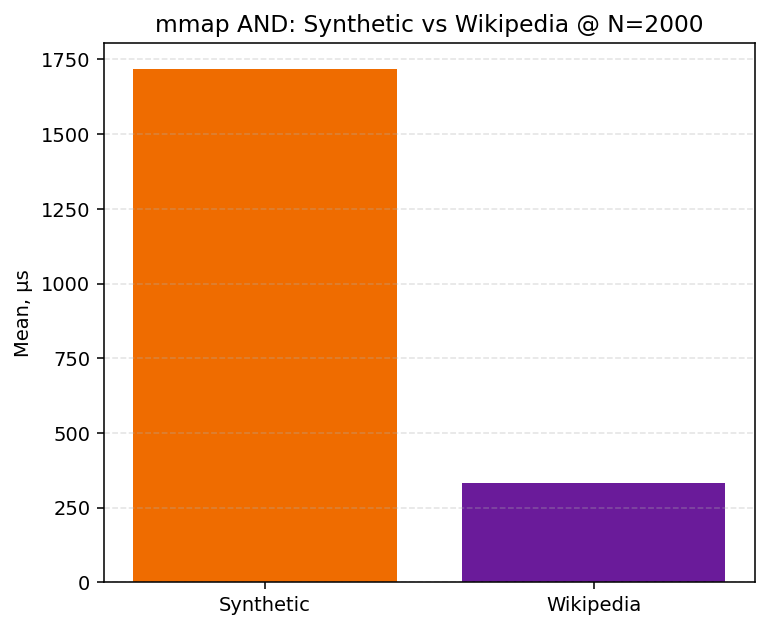

# Глубокий анализ бенчмарков HW5

## Методика

| Параметр | Значение |
| --- | --- |
| Synthetic | seed 42, 24 терма/док, N∈{2000, 10000} |
| Wikipedia | shard pages-articles1, N∈{2000, 5000}, medium-DF запросы |
| BDN | Warm iter=8; Cold — IndexQuery; OperationsPerInvoke=32 |
| Запросы Wiki | top medium-DF (2–35% doc), без wikitext markup |

## IndexQuery AND @ N=2000

| Корпус | RAM µs | mmap µs | mmap/RAM | CV RAM |
| --- | ---: | ---: | ---: | ---: |
| Synthetic | **834.10** | 1717.60 | 2.06× | 8.2% |
| Wikipedia | **223.30** | 334.00 | 1.50× | 3.9% |

## Масштабирование RAM AND

- Synthetic N=2000: **1914.00 µs**, CV=29.5%
- Synthetic N=10000: **18576.10 µs**, CV=36.8%
- Wikipedia N=2000: **252.50 µs**, CV=8.8%
- Wikipedia N=5000: **1897.80 µs**, CV=27.3%

## Wikipedia операторы

| Оператор | N | Mean µs | CV |
| --- | ---: | ---: | ---: |
| `Adj` | 2000 | 132.50 | 11.1% |
| `Adj` | 5000 | 410.60 | 24.6% |
| `And` | 2000 | 294.20 | 14.2% |
| `And` | 5000 | 642.80 | 15.1% |
| `Near` | 2000 | 139.70 | 3.7% |
| `Near` | 5000 | 674.50 | 5.2% |
| `Not` | 2000 | 390.40 | 5.2% |
| `Not` | 5000 | 681.80 | 2.0% |
| `Or` | 2000 | 296.00 | 6.9% |
| `Or` | 5000 | 555.40 | 3.2% |

## Проверка гипотез

| ID | Гипотеза | Вердикт |
| --- | --- | --- |
| H_corpus | Wiki AND дороже Synthetic @ 2000 | Частично |
| H_disk | mmap 1.3–1.6× RAM | **Подтверждена** (2.06× synth) |
| H_naive | indexed ≫ naive | **Подтверждена** (naive_index_ratio) |

## CV > 5%

- `IndexBuildBenchmarks.SealAndWriteSegment` (Synthetic, N=2000): **11.2%**
- `IndexBuildBenchmarks.SealAndWriteSegment` (Wikipedia, N=2000): **9.8%**
- `IndexBuildBenchmarks.SealAndWriteSegment` (Wikipedia, N=5000): **7.7%**
- `IndexBuildBenchmarks.NaivePostingBytes` (Wikipedia, N=5000): **77.1%**
- `IndexQueryBenchmarks.Memory_AndQuery` (Synthetic, N=2000): **8.2%**
- `IndexQueryBenchmarks.DiskMmap_AndQuery` (Synthetic, N=2000): **6.2%**
- `IndexQueryBenchmarks.Memory_NearAdjQuery` (Synthetic, N=2000): **8.5%**
- `IndexQueryBenchmarks.Memory_Bm25Top10` (Synthetic, N=2000): **14.4%**
- `IndexQueryBenchmarks.Memory_NearAdjQuery` (Wikipedia, N=2000): **8.4%**
- `IndexQueryBenchmarks.Memory_Bm25Top10` (Wikipedia, N=2000): **8.6%**
- `IndexQueryScalingBenchmarks.Memory_AndQuery` (Synthetic, N=10000): **36.8%**
- `IndexQueryScalingBenchmarks.DiskMmap_AndQuery` (Synthetic, N=10000): **12.3%**
- `IndexQueryScalingBenchmarks.Memory_AndQuery` (Synthetic, N=2000): **29.5%**
- `IndexQueryScalingBenchmarks.DiskMmap_AndQuery` (Synthetic, N=2000): **38.7%**
- `IndexQueryScalingBenchmarks.Memory_AndQuery` (Wikipedia, N=2000): **8.8%**
- `IndexQueryScalingBenchmarks.DiskMmap_AndQuery` (Wikipedia, N=2000): **18.3%**
- `IndexQueryScalingBenchmarks.Memory_AndQuery` (Wikipedia, N=5000): **27.3%**
- `IndexQueryScalingBenchmarks.DiskMmap_AndQuery` (Wikipedia, N=5000): **25.0%**
- `MmapTouchBenchmarks.RepeatedMmap_AndQuery` (Synthetic, N=2000): **10.6%**
- `NaiveScanBenchmarks.IndexedAndQuery` (Synthetic, N=128): **5.2%**
- `OperatorBenchmarks.AndQuery` (Synthetic, N=2000): **45.7%**
- `OperatorBenchmarks.NotQuery` (Synthetic, N=2000): **9.6%**
- `OperatorBenchmarks.AdjQuery` (Synthetic, N=2000): **18.6%**
- `OperatorBenchmarks.NearQuery` (Synthetic, N=2000): **12.2%**
- `OperatorBenchmarks.AndQuery` (Wikipedia, N=2000): **14.2%**
- `OperatorBenchmarks.OrQuery` (Wikipedia, N=2000): **6.9%**
- `OperatorBenchmarks.NotQuery` (Wikipedia, N=2000): **5.2%**
- `OperatorBenchmarks.AdjQuery` (Wikipedia, N=2000): **11.1%**
- `OperatorBenchmarks.AndQuery` (Wikipedia, N=5000): **15.1%**
- `OperatorBenchmarks.AdjQuery` (Wikipedia, N=5000): **24.6%**
- `OperatorBenchmarks.NearQuery` (Wikipedia, N=5000): **5.2%**
- `RankingBenchmarks.BooleanOnly` (Synthetic, N=2000): **5.6%**
- `RankingBenchmarks.TfIdfTop10` (Synthetic, N=2000): **12.3%**
- `RankingBenchmarks.Bm25Top10` (Synthetic, N=2000): **8.1%**
- `RankingBenchmarks.BooleanOnly` (Wikipedia, N=2000): **14.2%**
- `RankingBenchmarks.TfIdfTop10` (Wikipedia, N=2000): **5.3%**
- `RankingBenchmarks.BooleanOnly` (Wikipedia, N=5000): **8.1%**
- `RankingBenchmarks.TfIdfTop10` (Wikipedia, N=5000): **27.8%**
- `RankingBenchmarks.Bm25Top10` (Wikipedia, N=5000): **11.8%**

## Графики

